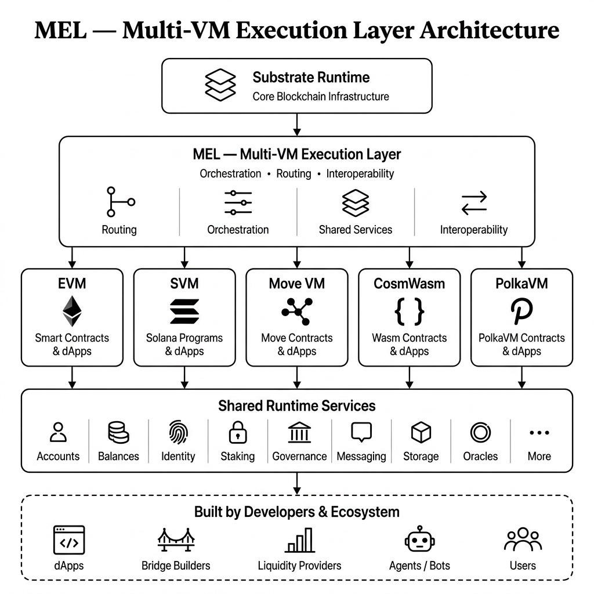
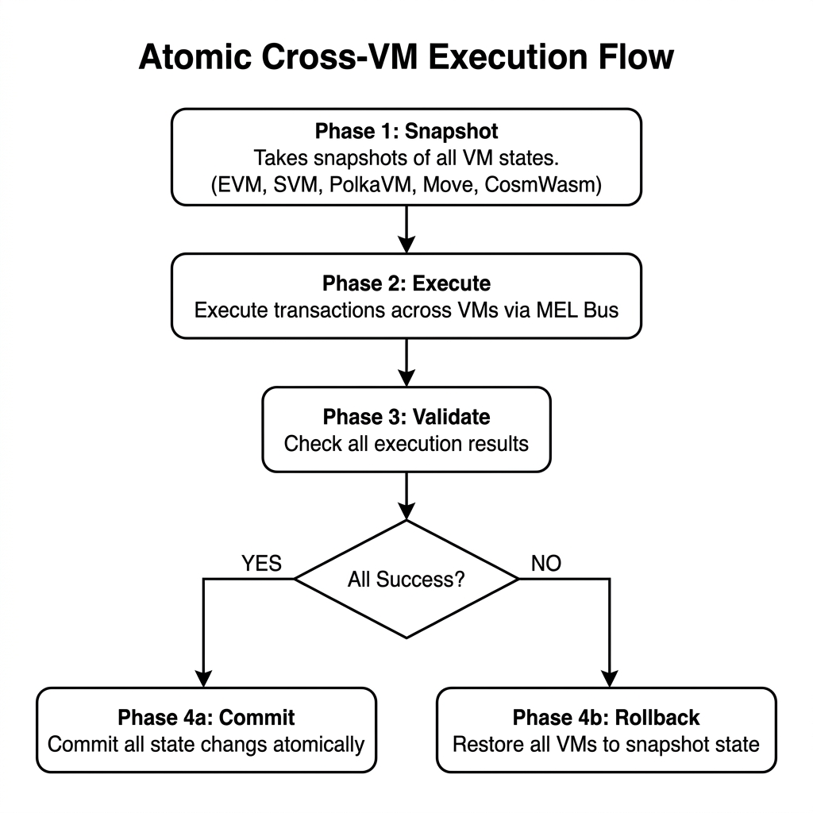
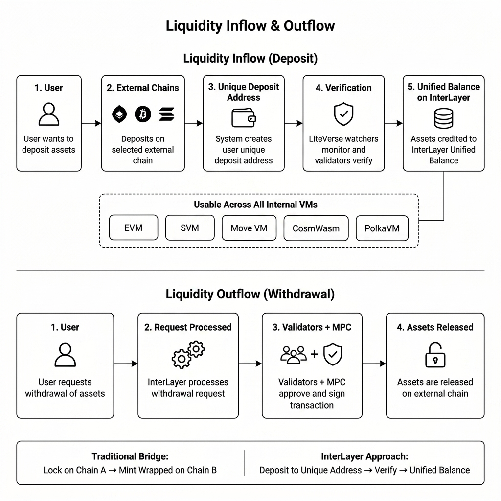
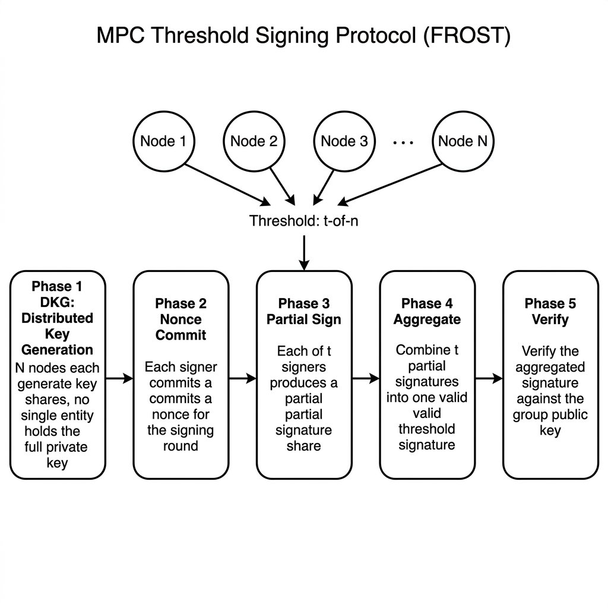

# InterLayer: Core Protocol Specification & Technical Architecture

**Gravity Testnet Protocol Blueprint & System Architecture Reference**

**Author:** Bharath B R ([@Bharathcoorg](https://forum.polkadot.network/u/Bharathcoorg))
**Version:** Gravity Testnet Specification
**Status:** Active Core Protocol Specification & Technical Architecture — Official Release Edition
**Repository:** [interlayer-gravity-testnet](https://github.com/Bharathcoorg/interlayer-gravity-testnet)

---

## Abstract

This document presents the core protocol specification and technical architecture blueprint for **InterLayer (Gravity Testnet)**, a zero-trust, multi-virtual machine Layer-1/Interlayer state transition platform built on Substrate. InterLayer introduces the **Multi-VM Execution Layer (MEL)**, enabling heterogeneous, atomic contract execution across five major Virtual Machine standards—Ethereum Virtual Machine (EVM), Solana Virtual Machine (SVM), PolkaVM (RISC-V), Move VM, and CosmWasm—within a single unified state machine kernel.

Rather than relying on traditional wrapped-asset bridge contracts that lock assets on Chain A to mint synthetic tokens on Chain B, InterLayer introduces a native **LiteVerse DePIN Watcher Mesh** paired with **Threshold Multi-Party Computation (MPC TSS)**. Users receive unique per-user, per-chain deposit addresses across Bitcoin, Ethereum, Solana, and external networks; deposits are verified directly into a single unified native balance usable seamlessly across all five internal VM execution environments.

This specification establishes the core architectural design of the global state trie, the atomic transaction execution engine, the state rollback engine, the universal gas calibration model, the canonical unified address resolution system, the 3-Chain HotStuff BFT consensus protocol, the off-chain threshold MPC key generation and signing protocols, the non-inflationary real-yield fee distribution engine, and exhaustive technical specifications for 36 core active Substrate runtime pallets.

---

## Document Scope & Conventions

This is a **protocol architecture specification** describing the target system design of InterLayer (Gravity Testnet). It serves as the authoritative reference for protocol designers, validators, and developers building on InterLayer.

**Conventions used in this document:**
- **Rust code blocks** represent either actual production code extracted from the repository or design-target pseudocode illustrating intended data structures and algorithms. When a code block is sourced directly from a specific file, the source is noted in the surrounding text.
- **Tables and parameter values** (gas costs, fee percentages, confirmation depths, staking parameters) reflect the current testnet configuration. All governance-configurable parameters are noted as such.
- Features not yet implemented are described as part of the target architecture and will be delivered in subsequent releases.

## Implementation Status

| Component | Status | Details |
| :--- | :--- | :--- |
| **Substrate Runtime** | ✅ Implemented | 173 KB monolithic runtime (`runtime/src/lib.rs`) |
| **Runtime Pallets** | ✅ 38 pallets implemented | All 38 have `#[pallet::call]`, `#[pallet::storage]`, `#[pallet::event]`; 14/38 have unit tests |
| **HotStuff BFT Consensus** | ✅ Implemented | 17 Rust source files, 4,235 lines (`consensus/hotstuff/`) |
| **VM Adapters (EVM, SVM, PolkaVM, Move, CosmWasm)** | ✅ Integrated | Compiled inline within the monolithic runtime (not separate crate directories) |
| **RPC Handlers** | ✅ Implemented | 10 handler files, 4,381 total lines across 18 namespaces |
| **MPC Threshold Signer** | ✅ Executor implemented | `mpc-executor/`: 9 Rust source files; `mpc-nodes/` and `mpc-recovery/` are Docker orchestration configurations |
| **Portal Dashboard** | ✅ Implemented | Full-stack web application for testnet interaction |
| **Bridge Pallet** | ⏸️ Optional | 915 lines implemented but excluded from core spec (future activation via governance) |
| **DEX Pallet** | ⏸️ Optional | 218 lines implemented but excluded from core spec (future activation via governance) |
| **LiteVerse Mobile App** | 📋 Planned | CLI tooling available; mobile app planned for Phase 2 |

---

## Table of Contents

1. [Chapter 1: System Overview & Protocol Architecture](#chapter-1-system-overview--protocol-architecture)
2. [Chapter 2: State Machine Architecture & Global Storage Layout](#chapter-2-state-machine-architecture--global-storage-layout)
3. [Chapter 3: Multi-VM Execution Layer (MEL) Engine Architecture](#chapter-3-multi-vm-execution-layer-mel-engine-architecture)
4. [Chapter 4: Canonical Unified Address Space & Asset Accounting](#chapter-4-canonical-unified-address-space--asset-accounting)
5. [Chapter 5: LiteVerse DePIN Watcher Mesh & Liquidity Orchestration](#chapter-5-liteverse-depin-watcher-mesh--liquidity-orchestration)
6. [Chapter 6: Pipelined 3-Chain HotStuff BFT Consensus Protocol](#chapter-6-pipelined-3-chain-hotstuff-bft-consensus-protocol)
7. [Chapter 7: Deep-Dive Virtual Machine Execution Adapters](#chapter-7-deep-dive-virtual-machine-execution-adapters)
8. [Chapter 8: Off-Chain Threshold MPC Signer Infrastructure (TSS)](#chapter-8-off-chain-threshold-mpc-signer-infrastructure-tss)
9. [Chapter 9: Cryptographic Foundations & Quantum Signature Engine](#chapter-9-cryptographic-foundations--quantum-signature-engine)
10. [Chapter 10: Real-Yield Economic Model & Fee Routing Engine](#chapter-10-real-yield-economic-model--fee-routing-engine)
11. [Chapter 11: Comprehensive Substrate Runtime Pallet Architecture (36 Core Active Runtime Pallets)](#chapter-11-comprehensive-substrate-runtime-pallet-architecture-36-core-active-runtime-pallets)
12. [Chapter 12: Wire-Format & Binary Serialization Specifications (SCALE, RLP, Borsh, BCS, Wasm)](#chapter-12-wire-format--binary-serialization-specifications-scale-rlp-borsh-bcs-wasm)
13. [Chapter 13: Exhaustive JSON-RPC Interface & API Specification (Core, MEL, LiteVerse, MPC)](#chapter-13-exhaustive-json-rpc-interface--api-specification-core-mel-liteverse-mpc)
14. [Chapter 14: Multi-VM Smart Contract & Cross-VM Developer Integration Guide](#chapter-14-multi-vm-smart-contract--cross-vm-developer-integration-guide)
15. [Chapter 15: System Invariants & Protocol Guarantees](#chapter-15-system-invariants--protocol-guarantees)

**Appendices**

- [Appendix A: Testnet Deployment Configuration](#appendix-a-testnet-deployment-configuration)
- [Appendix B: List of Figures](#appendix-b-list-of-figures)
- [Appendix C: Public Runtime Composition Index](#appendix-c-public-runtime-composition-index)
- [Appendix D: Canonical Protocol Type Definitions](#appendix-d-canonical-protocol-type-definitions)
- [Appendix E: Gas Calibration Constants & Cross-VM Overhead Matrix](#appendix-e-gas-calibration-constants--cross-vm-overhead-matrix)
- [Appendix F: MPC Threshold Signer Protocol Listings](#appendix-f-mpc-threshold-signer-protocol-listings)
- [Appendix G: HotStuff Consensus Protocol Reference](#appendix-g-hotstuff-consensus-protocol-reference)
- [Appendix H: Atomic Execution State Machine Reference](#appendix-h-atomic-execution-state-machine-reference)
- [Appendix I: Glossary of Terms](#appendix-i-glossary-of-terms)

---

## Chapter 1: System Overview & Protocol Architecture

### 1.1 Executive Summary & Historical Context
The evolution of decentralized smart contract platforms over the past decade has produced an explosion of specialized execution machines. Ethereum introduced the Ethereum Virtual Machine (EVM) in 2015, establishing stack-based, 256-bit word execution with Solidity bytecodes. Solana introduced Sealevel in 2020, leveraging parallel eBPF bytecodes to enable non-overlapping account state concurrency. Polkadot introduced PolkaVM, bringing RISC-V zero-cost abstraction compilation to Web3. Aptos and Sui popularized Diem's Move VM, emphasizing linear asset resources and formal memory safety. Meanwhile, Cosmos standardized CosmWasm, deploying WebAssembly (Wasm) actor model smart contracts across Tendermint chains.

While each virtual machine excels in its native domain, this diversity has created catastrophic execution fragmentation across the Web3 ecosystem. Developers are forced to rebuild smart contracts from scratch in different languages for each ecosystem. Users are trapped in isolated state silos, forced to move assets across third-party wrapped-asset bridges that lock funds on Chain A to mint synthetic tokens on Chain B. Historically, cross-chain bridge hacks have accounted for over $2.8 billion in lost protocol funds, exposing the fundamental structural risk of wrapped-asset messaging bridges.

InterLayer solves this execution and liquidity fragmentation at the root layer. Built as a native Substrate blockchain kernel, InterLayer introduces the **Multi-VM Execution Layer (MEL)**—an integrated execution engine that embeds all five major virtual machine standards (EVM, SVM, PolkaVM, Move VM, and CosmWasm) directly within a single unified Substrate state machine runtime.

Operating as a purely **sequencer-free, decentralized BFT network**, InterLayer eliminates centralized sequencer single-point-of-failure risks. Block proposal, transaction ordering, and state validation are executed directly by validator nodes running Pipelined 3-Chain HotStuff BFT consensus with sub-500ms block targets and 10ms fast polling loops.

### 1.2 Core Architectural Principles of the InterLayer Substrate Kernel
The design of InterLayer rests upon four foundational architectural principles:

1. **State-Level Unification Over Message-Passing Bridges**: Rather than passing asynchronous messages between distinct blockchains, InterLayer unifies storage, account balances, and contract state under a single global Merkle Patricia Trie.
2. **Heterogeneous VM Native Adapters**: VM execution environments are integrated into the runtime executive as first-class adapters (`mel-evm`, `mel-svm`, `mel-polkavm`, `mel-move`, `mel-cosmwasm`). Contracts run natively without compiling down to a lowest-common-denominator intermediate representation.
3. **Atomic Cross-VM Bundles**: Developers can assemble an atomic transaction bundle containing contract calls to multiple distinct VMs (for example, executing an EVM swap followed by a Solana program instruction in a single block). If any call fails, the entire atomic bundle rolls back cleanly without state corruption.
4. **Native Unique Deposit Addresses via LiteVerse DePIN & MPC TSS**: Users do not hold wrapped synthetic tokens. Every user is allocated unique per-user, per-chain deposit addresses on Bitcoin, Ethereum, Solana, and external networks. Deposits are monitored by the LiteVerse DePIN Watcher Mesh and signed by an off-chain Threshold Multi-Party Computation (MPC TSS) validator network, crediting a single unified native balance directly usable across all internal VMs.

### 1.3 Minimalist System Architecture Diagram



---


### 1.4 Network Participant Roles

InterLayer defines four distinct network participant classes, each with dedicated responsibilities and reward streams:

```rust
enum NetworkRole {
    Validator,       // Block production, finality, consensus participation
    LiteVerseNode,   // DePIN watcher mesh (mobile/browser/desktop)
    MpcSigner,       // Threshold signing for external chain custody
    Treasury,        // Protocol-owned reserve for governance spending
}
```

| Role | Responsibility | Reward Source |
| :--- | :--- | :--- |
| **Validator** | Block production, HotStuff BFT consensus, state validation, slashing enforcement | Share of transaction gas fees (configurable via governance) |
| **LiteVerse Watcher** | External chain deposit verification, data availability sampling, finality header checks | Share of gas fees + bridge verification rewards |
| **MPC Signer Node** | Distributed key generation (DKG), threshold signing for Bitcoin/Ethereum/Solana withdrawals | Share of gas fees + external route operation fees |
| **Treasury** | Protocol-owned account for development grants, ecosystem funding, governance proposals | Share of gas fees (accumulates for governance-approved spending) |

---

## Chapter 2: State Machine Architecture & Global Storage Layout

### 2.1 Core Data Types & Conventions
Throughout this specification, the following core Rust data types are referenced:

```rust
type Hash256 = [u8; 32];     // Blake2b-256 hash output
type Address20 = [u8; 20];   // EVM-style 160-bit address
type Address32 = [u8; 32];   // Substrate/SVM/PolkaVM 256-bit address

#[derive(Clone, Copy, PartialEq)]
enum VmType {
    EVM,       // Ethereum Virtual Machine (revm)
    SVM,       // Solana Virtual Machine (solana_rbpf)
    PolkaVM,   // RISC-V Virtual Machine (polkavm)
    Move,      // Move VM (move-vm-runtime)
    CosmWasm,  // WebAssembly (wasmi)
}
```

### 2.2 Global State Structure
The global state is composed of 8 isolated sub-state storage tries, each backed by a Substrate Merkle Patricia Trie:

```rust
/// The global runtime state, committed as a single Blake2b-256 root in each block header.
struct GlobalState {
    evm_state:      EvmSubState,       // revm account storage: nonces, balances, code, slots
    svm_state:      SvmSubState,       // Solana PDAs, account data vectors (up to 10MB), lamports
    polkavm_state:  PolkaVmSubState,   // RISC-V bytecodes, memory pages, PSP-22/PSP-34 items
    move_state:     MoveSubState,      // Resource tags (Address, StructTag) => bytes, module bytecodes
    cosmwasm_state: CosmWasmSubState,  // Wasm state keys, contract instantiations, Bech32 balances
    unified:        UnifiedSubState,   // Canonical 32-byte addresses → sub-VM handles, native balances
    staking:        StakingSubState,   // Active validators, delegator pools, unbonding queues, slashing
    mpc:            MpcSubState,       // DKG secret shares, threshold signing queues, master pubkeys
}
```

Each sub-state maps keys to values via a Substrate storage trie. The sub-states are logically isolated — a write to `evm_state` cannot corrupt `svm_state`.

### 2.3 Merkle Patricia Trie Commitments & Block Transition
The global state root hash is computed by Substrate's Merkle Patricia Trie engine:

```rust
/// Compute the Blake2b-256 state root committed in each block header.
fn compute_state_root(state: &GlobalState) -> Hash256 {
    blake2b_256(
        trie_root(&state.evm_state)
        ++ trie_root(&state.svm_state)
        ++ trie_root(&state.polkavm_state)
        ++ trie_root(&state.move_state)
        ++ trie_root(&state.cosmwasm_state)
        ++ trie_root(&state.unified)
        ++ trie_root(&state.staking)
        ++ trie_root(&state.mpc)
    )
}

/// Block state transition: apply all extrinsics in block B_n to produce new state.
fn execute_block(prev_state: GlobalState, block: Block) -> GlobalState {
    let mut state = prev_state;
    for extrinsic in block.extrinsics {
        state = apply_extrinsic(state, extrinsic);
    }
    state  // state_root is committed in block header
}
```

### 2.4 State Space Vector Diagram

<svg viewBox="0 0 800 420" width="100%" height="auto" xmlns="http://www.w3.org/2000/svg" style="background:#ffffff; font-family:-apple-system,BlinkMacSystemFont,'Segoe UI',Roboto,Helvetica,Arial,sans-serif;">
  <rect x="40" y="30" width="720" height="360" rx="16" ry="16" fill="#ffffff" stroke="#111111" stroke-width="2.5"/>
  <text x="400" y="65" font-size="18" font-weight="700" fill="#111111" text-anchor="middle">Global State Tuple State Structure &amp; Merkle Root H(State)</text>
  <line x1="60" y1="85" x2="740" y2="85" stroke="#e0e0e0" stroke-width="1.5"/>

  <!-- Substates -->
  <rect x="60" y="110" width="150" height="70" rx="10" fill="#ffffff" stroke="#111111" stroke-width="1.5"/>
  <text x="135" y="140" font-size="14" font-weight="600" text-anchor="middle">EVM State</text>
  <text x="135" y="160" font-size="11" fill="#666666" text-anchor="middle">revm Account Storage</text>

  <rect x="225" y="110" width="150" height="70" rx="10" fill="#ffffff" stroke="#111111" stroke-width="1.5"/>
  <text x="300" y="140" font-size="14" font-weight="600" text-anchor="middle">SVM State</text>
  <text x="300" y="160" font-size="11" fill="#666666" text-anchor="middle">Solana Account Vectors</text>

  <rect x="390" y="110" width="150" height="70" rx="10" fill="#ffffff" stroke="#111111" stroke-width="1.5"/>
  <text x="465" y="140" font-size="14" font-weight="600" text-anchor="middle">PolkaVM State</text>
  <text x="465" y="160" font-size="11" fill="#666666" text-anchor="middle">RISC-V Contract State</text>

  <rect x="555" y="110" width="180" height="70" rx="10" fill="#ffffff" stroke="#111111" stroke-width="1.5"/>
  <text x="645" y="140" font-size="14" font-weight="600" text-anchor="middle">Move & CosmWasm State</text>
  <text x="645" y="160" font-size="11" fill="#666666" text-anchor="middle">Resources &amp; Wasmi Store</text>

  <!-- Merkle Combine Arrows -->
  <path d="M 135 180 L 135 230 L 400 230" fill="none" stroke="#111111" stroke-width="1.5"/>
  <path d="M 300 180 L 300 230" stroke="#111111" stroke-width="1.5"/>
  <path d="M 465 180 L 465 230" stroke="#111111" stroke-width="1.5"/>
  <path d="M 645 180 L 645 230 L 400 230" fill="none" stroke="#111111" stroke-width="1.5"/>

  <path d="M 400 230 L 400 260" stroke="#111111" stroke-width="2"/>

  <!-- Merkle Root Box -->
  <rect x="250" y="260" width="300" height="90" rx="12" fill="#ffffff" stroke="#111111" stroke-width="2"/>
  <text x="400" y="295" font-size="16" font-weight="700" text-anchor="middle">Blake2b-256 State Root H(State)</text>
  <text x="400" y="325" font-size="12" fill="#555555" text-anchor="middle">Committed in Substrate Block Header</text>
</svg>

---

## Chapter 3: Multi-VM Execution Layer (MEL) Engine Architecture


### 3.1 Intuitive Explanation of Multi-VM Atomic Execution
In traditional single-VM networks (like Ethereum or Solana), smart contract execution is constrained to a single execution environment. If a dApp requires logic across Solidity (EVM) and Solana (SVM), the user must perform two asynchronous transactions connected through an external cross-chain messaging bridge. This introduces multi-block latency, bridge fee overhead, and severe vulnerability to front-running and bridge exploits.

MEL resolves this by providing a unified meta-execution layer. When an **Atomic Bundle**  is submitted to the network:
1. **Validation & Checkpoint**: MEL validates the context deadline and generates a baseline state snapshot .
2. **Sequential Execution**: MEL passes call `call_1` to the source VM adapter (e.g. `mel-evm`), staging state mutations in transient memory. It then passes call `call_2` to the target VM adapter (e.g. `mel-svm`), staging its state mutations.
3. **Atomic Commit**: If all operations execute without error (`error_i == None`), staged state diffs commit simultaneously to global storage `state`.
4. **Instant Rollback**: If any operation produces an exception or error (`error_i != None`), the rollback operator  reverts global state back to `state`, leaving storage untouched.

### 3.2 Atomic Execution Flowchart




### 3.3 Atomic Bundle Execution Engine
An **Atomic Bundle** contains a vector of contract operations across arbitrary VM types:

```rust
struct AtomicBundle {
    bundle_id:    Hash256,
    operations:   Vec<ContractCall>,  // ordered list of cross-VM calls
    deadline_ms:  u64,                // expiration timestamp
    source_vm:    VmType,
    target_vm:    VmType,
}

struct ContractCall {
    vm:           VmType,
    target_addr:  Vec<u8>,    // target contract address (20-32 bytes)
    calldata:     Vec<u8>,    // native VM-encoded call payload
    gas_budget:   u64,        // maximum gas authorized for this call
}

/// Core atomic execution logic
fn execute_atomic_bundle(state: GlobalState, bundle: AtomicBundle) -> (GlobalState, BundleStatus) {
    let snapshot = state.checkpoint();                      // Phase 1: Snapshot
    let mut staged_state = state.clone();

    for call in &bundle.operations {
        match execute_vm_call(&mut staged_state, call) {    // Phase 2-3: Execute
            Ok(_) => continue,
            Err(_) => return (snapshot.restore(), BundleStatus::RolledBack),  // Rollback
        }
    }

    let total_gas: u64 = bundle.operations.iter()
        .map(|c| calibrate_gas(c.gas_budget, c.vm))
        .sum();

    if total_gas > GAS_LIMIT {
        return (snapshot.restore(), BundleStatus::RolledBack);
    }

    staged_state.commit();                                  // Phase 4-5: Commit
    (staged_state, BundleStatus::Committed)
}
```


### 3.5 MEV Protection & Frontrun Guard Pipeline

To prevent malicious front-running, sandwich attacks, and value extraction by block proposers, the Multi-VM Execution Layer integrates `pallet-mev-protection` and `mev_controls`:

```rust
struct MevProtectionConfig {
    commit_reveal_enabled: bool,    // Require two-phase transaction commitment
    min_reveal_delay_blocks: u32,   // Blocks between commit and reveal
    encrypted_staging: bool,        // Stage execution diffs under transient encryption
    fair_ordering_policy: Ordering, // FIFO / Blind Auction / Random Batch
}

enum Ordering {
    Fifo,
    EncryptedBatch,
    BlindAuction,
}
```

1. **Commit-Reveal Execution**: Users submit a cryptographic commitment `hash(tx_payload || salt)` in Phase 1. The transaction payload remains hidden from validators until the commitment is included in a block.
2. **Encrypted Batch Staging**: In Phase 2, atomic bundle transactions are staged in transient memory under zero-knowledge or threshold encryption. Validators execute state transitions without visibility into individual contract swap parameters until the state diff is finalized.
3. **Fair Ordering Enforcement**: The consensus engine enforces strict FIFO or blind-auction ordering rules, penalizing validators via `pallet-slashing` if re-ordering or front-running patterns are detected.

### 3.4 Universal Gas Metering & Calibration Engine
To compute transaction fees fairly across heterogeneous compute engines, MEL maps native VM instruction units to a standardized gas metric using calibration multipliers:

```rust
/// Calibrate native VM gas units to InterLayer standard gas.
fn calibrate_gas(native_gas: u64, vm: VmType) -> u64 {
    let multiplier: f64 = match vm {
        VmType::EVM      => 1.00,  // 1 EVM Gas Unit = 1.00 Standard Gas
        VmType::SVM      => 0.05,  // 1 Solana Compute Unit = 0.05 Standard Gas
        VmType::PolkaVM  => 0.01,  // 1 RISC-V Cycle = 0.01 Standard Gas
        VmType::Move     => 0.80,  // 1 Move Gas Unit = 0.80 Standard Gas
        VmType::CosmWasm => 0.10,  // 1 Wasmi Instruction = 0.10 Standard Gas
    };
    (native_gas as f64 * multiplier).ceil() as u64
}

/// Compute total transaction fee for an atomic bundle.
fn compute_bundle_fee(bundle: &AtomicBundle, base_gas_price: u128) -> u128 {
    let total_calibrated_gas: u64 = bundle.operations.iter()
        .map(|op| calibrate_gas(op.gas_budget, op.vm))
        .sum();
    (total_calibrated_gas as u128) * base_gas_price + ATOMIC_PREMIUM_FEE
}
```

| VM | Multiplier | Meaning |
| :--- | :--- | :--- |
| **EVM** | 1.00 | 1 EVM gas unit = 1.00 standard gas |
| **SVM** | 0.05 | 1 Solana compute unit = 0.05 standard gas |
| **PolkaVM** | 0.01 | 1 RISC-V cycle = 0.01 standard gas |
| **Move** | 0.80 | 1 Move gas unit = 0.80 standard gas |
| **CosmWasm** | 0.10 | 1 Wasmi instruction = 0.10 standard gas |

**Admission Rule**: The total calibrated gas plus the cross-VM coordination charge must not exceed the block gas limit. Implementations MUST reject a bundle before execution if this bound cannot be satisfied; they MUST NOT silently round a fractional calibrated charge downward.

---

## Chapter 4: Canonical Unified Address Space & Asset Accounting

### 4.1 Dual-Mode Address Architecture

InterLayer introduces a **Dual-Mode Address Architecture** designed to bridge native VM address formats with modern Account Abstraction (inspired by ERC-4337 and Cosmos ICA):

1. **Mode 1 — Native Virtual Machine Addresses**: Every account is assigned a canonical 32-byte unified address. This unified address is deterministically mapped to VM-native formats:
   - **EVM**: 20-byte hexadecimal address (`0x...`)
   - **SVM**: 32-byte Base58 address
   - **PolkaVM**: 32-byte SS58-encoded account identifier
   - **Move VM**: Chain-configured Move address width (typically 16 or 32 bytes)
   - **CosmWasm**: Bech32 string with human-readable prefix `il`

2. **Mode 2 — Account Abstraction Smart Accounts**: Managed by `pallet-smart-accounts`, enabling multi-sig threshold rules, session keys, emergency key recovery, and gas sponsorship. Smart accounts wrap underlying VM execution handles, allowing a single transaction to execute across multiple VM environments under unified authorization.

### 4.2 Universal Handle System (`@username`)

To simplify user interaction, `unified-address-registry` provides an on-chain **Universal Handle System**:
- Users register human-readable handles (e.g., `@alice`) via `mel_registerHandle`.
- **Name Normalization**: Handles are automatically lowercased, stripped of trailing whitespace, and checked for character uniqueness to prevent spoofing and homograph attacks.
- **Replay Protection**: Each address binding increments a deterministic binding nonce, preventing signature replay across chains or VM instances.

### 4.3 Address Resolution (`resolve_address()`)

Every account entity on InterLayer is assigned a canonical 32-byte unified address. The registry maintains a restricted mapping between unified addresses and each VM's native address space.

A global bijection from 32-byte unified identifiers to a 20-byte EVM address space cannot exist — at registration, the registry records a unique native address and rejects collisions. Hash-derived values are candidate addresses only, never a proof of uniqueness. Reverse resolution is always performed through the committed registry record, not by reversing a hash.

A mapping is valid only while its handle, ownership proof, domain, and address-format checks remain active on-chain.

### 4.2 Unified Address Resolution Diagram

<svg viewBox="0 0 800 360" width="100%" height="auto" xmlns="http://www.w3.org/2000/svg" style="background:#ffffff; font-family:-apple-system,BlinkMacSystemFont,'Segoe UI',Roboto,Helvetica,Arial,sans-serif;">
  <text x="400" y="35" font-size="18" font-weight="700" fill="#111111" text-anchor="middle">Unified Address Bijection Address Mapping</text>

  <!-- Central Unified Address -->
  <rect x="250" y="60" width="300" height="60" rx="12" fill="#ffffff" stroke="#111111" stroke-width="2.5"/>
  <text x="400" y="88" font-size="15" font-weight="700" text-anchor="middle">Unified Address (32-byte Key)</text>
  <text x="400" y="106" font-size="11" fill="#555555" text-anchor="middle">Canonical User Identity</text>

  <!-- Arrows to 5 VM Formats -->
  <path d="M 280 120 L 100 200" stroke="#111111" stroke-width="1.5"/>
  <path d="M 340 120 L 250 200" stroke="#111111" stroke-width="1.5"/>
  <path d="M 400 120 L 400 200" stroke="#111111" stroke-width="1.5"/>
  <path d="M 460 120 L 550 200" stroke="#111111" stroke-width="1.5"/>
  <path d="M 520 120 L 700 200" stroke="#111111" stroke-width="1.5"/>

  <!-- 5 Targets -->
  <rect x="30" y="200" width="140" height="90" rx="10" fill="#ffffff" stroke="#111111" stroke-width="1.5"/>
  <text x="100" y="230" font-size="13" font-weight="700" text-anchor="middle">EVM Address</text>
  <text x="100" y="255" font-size="11" fill="#555555" text-anchor="middle">20-byte Hex</text>
  <text x="100" y="272" font-size="10" fill="#777777" text-anchor="middle">0x71C...a29</text>

  <rect x="180" y="200" width="140" height="90" rx="10" fill="#ffffff" stroke="#111111" stroke-width="1.5"/>
  <text x="250" y="230" font-size="13" font-weight="700" text-anchor="middle">SVM Pubkey</text>
  <text x="250" y="255" font-size="11" fill="#555555" text-anchor="middle">32-byte Base58</text>
  <text x="250" y="272" font-size="10" fill="#777777" text-anchor="middle">7xK8...mP9</text>

  <rect x="330" y="200" width="140" height="90" rx="10" fill="#ffffff" stroke="#111111" stroke-width="1.5"/>
  <text x="400" y="230" font-size="13" font-weight="700" text-anchor="middle">PolkaVM ID</text>
  <text x="400" y="255" font-size="11" fill="#555555" text-anchor="middle">32-byte SS58</text>
  <text x="400" y="272" font-size="10" fill="#777777" text-anchor="middle">5Grw...bQ5</text>

  <rect x="480" y="200" width="140" height="90" rx="10" fill="#ffffff" stroke="#111111" stroke-width="1.5"/>
  <text x="550" y="230" font-size="13" font-weight="700" text-anchor="middle">Move Address</text>
  <text x="550" y="255" font-size="11" fill="#555555" text-anchor="middle">16-byte Hex</text>
  <text x="550" y="272" font-size="10" fill="#777777" text-anchor="middle">0x00...01</text>

  <rect x="630" y="200" width="140" height="90" rx="10" fill="#ffffff" stroke="#111111" stroke-width="1.5"/>
  <text x="700" y="230" font-size="13" font-weight="700" text-anchor="middle">CosmWasm</text>
  <text x="700" y="255" font-size="11" fill="#555555" text-anchor="middle">Bech32 String</text>
  <text x="700" y="272" font-size="10" fill="#777777" text-anchor="middle">il1q2w...x8</text>
</svg>

### 4.5 Balance Conservation Invariant
For any unified address `a`, let `balance(a, k)` denote native `IL` tokens held within sub-state `k`. Global balance conservation requires that the sum of all balances across all sub-states plus the treasury reserve equals the total token supply at all times. No transaction or atomic bundle may create or destroy tokens — only transfer them between sub-states.

### 4.6 Implementation: `unified-address-registry` Pallet

The address resolution system is implemented in the **Unified Address Registry** pallet. This section documents the actual data structures, storage layout, and extrinsic interface.

#### 4.4.1 Chain Domain Enumeration

The system supports six external chain domains, each corresponding to a distinct address format:

```rust
pub enum ChainDomain {
    Ethereum,     // 20-byte Keccak-256 derived addresses
    Bitcoin,      // Bech32/Base58Check addresses
    Solana,       // 32-byte ed25519 public keys (Base58 encoded)
    Polkadot,     // 32-byte sr25519 public keys (SS58 encoded)
    Ton,          // 36-byte workchain:hash addresses
    InterLayer,   // 32-byte unified canonical addresses
}
```

#### 4.4.2 Address Type Discriminant

```rust
pub enum AddressType {
    Native,       // Substrate SS58 native format
    Evm,          // 20-byte Ethereum format
    SVM,          // 32-byte Solana format
    Move,         // 16-byte Move format
    PolkaVM,      // 32-byte PolkaVM/RISC-V format
    CrossVM,      // Unified cross-VM canonical address
}
```

#### 4.4.3 `UnifiedAddress` Structure

```rust
pub struct UnifiedAddress<HandleLen: Get<u32> = ConstU32<64>, AddressLen: Get<u32> = ConstU32<128>> {
    pub handle: BoundedVec<u8, HandleLen>,     // Human-readable handle (e.g., "bharath")
    pub domain: ChainDomain,                    // Target chain domain
    pub address: BoundedVec<u8, AddressLen>,    // Resolved native address bytes
    pub chain_id: u32,                          // EVM chain ID or chain-specific identifier
    pub is_active: bool,                        // Whether this mapping is currently active
}
```

#### 4.4.4 Handle Registration Lifecycle

Each handle is registered with ownership tracking, expiration, fee payment, verification status, and domain restrictions:

```rust
pub struct HandleRegistration<T: Config, HandleLen = ConstU32<64>, MaxDomains = ConstU32<10>> {
    pub handle: BoundedVec<u8, HandleLen>,               // The handle string
    pub owner: T::AccountId,                              // Substrate AccountId of the owner
    pub registered_at: BlockNumberFor<T>,                 // Block number of registration
    pub expires_at: Option<BlockNumberFor<T>>,            // Optional expiration block
    pub fee_paid: u128,                                   // Registration fee (in IL tokens)
    pub is_active: bool,                                  // Active status flag
    pub is_verified: bool,                                // Whether identity is verified
    pub allowed_domains: BoundedVec<ChainDomain, MaxDomains>, // Whitelisted chain domains
}
```

#### 4.4.5 Signature Scheme Support

Address verification supports both classical and post-quantum signature schemes:

```rust
pub enum SignatureScheme {
    Ecdsa,       // secp256k1 ECDSA (Ethereum-compatible)
    Ed25519,     // Edwards curve (Solana-compatible)
    Sr25519,     // Schnorrkel/Ristretto (Substrate-native)
    Dilithium,   // CRYSTALS-Dilithium lattice-based PQ signatures
    Falcon512,   // FALCON-512 NTRU lattice-based PQ signatures
    Hybrid,      // Classical + post-quantum dual verification
}
```

#### 4.4.6 On-Chain Storage Layout

The address registry maintains five storage maps:

| Storage Item | Type | Key | Value |
| :--- | :--- | :--- | :--- |
| `HandleRegistrations` | `StorageMap` | `BoundedVec<u8, 64>` (handle) | `HandleRegistration<T>` |
| `AddressMappings` | `StorageMap` | `(handle, ChainDomain)` | `AddressMapping<T>` |
| `UnifiedAddresses` | `StorageMap` | `BoundedVec<u8, 128>` (handle+domain) | `UnifiedAddress` |
| `DomainRegistrations` | `StorageMap` | `ChainDomain` | `u32` (count) |
| `AddressResolutionCache` | `StorageMap` | `BoundedVec<u8, 128>` (resolution key) | `AddressResolution<T>` |

#### 4.4.7 Registry Trait Interface

Other pallets interact with the address registry through the `UnifiedAddressRegistry` trait:

```rust
pub trait UnifiedAddressRegistry {
    type AccountId;
    fn register_unified_address(handle: Vec<u8>, vm_addresses: BTreeMap<AddressType, Vec<u8>>,
                                 metadata: Vec<u8>) -> DispatchResult;
    fn update_vm_address(handle: &Vec<u8>, ty: AddressType, address: Vec<u8>) -> DispatchResult;
    fn get_vm_address(handle: &Vec<u8>, ty: AddressType) -> Option<Vec<u8>>;
    fn get_all_vm_addresses(handle: &Vec<u8>) -> Vec<(AddressType, Vec<u8>)>;
    fn register_random_handle_for(account: Self::AccountId, domains: Vec<ChainDomain>)
        -> Result<Vec<u8>, DispatchError>;
}
```


### 4.7 IL Native Multi-VM Token Specification

**InterLayer (IL)** is the native gas and staking token of the InterLayer Gravity network. IL is **not** a wrapped token — it exists as a single unified balance at the runtime level, with VM-specific *view layers* that expose the same underlying balance using each VM's native token standard.

| Property | Value |
| :--- | :--- |
| **Name** | InterLayer |
| **Symbol** | IL |
| **Decimals** | 18 |
| **Total Supply** | Defined at genesis (0% inflation by default) |
| **Type** | Native Multi-VM Token |

```
┌─────────────────────────────────────────────────┐
│   Substrate Runtime (Single Source of Truth)     │
│       IL Balance: AccountId → u128              │
└──────────┬──────────┬──────────┬───────┬────────┘
           │          │          │       │
       ┌───▼───┐  ┌───▼───┐ ┌───▼───┐ ┌─▼─────┐
       │  EVM  │  │  SVM  │ │PolkaVM│ │  Move │
       │ERC-20 │  │  SPL  │ │PSP-22 │ │  Coin │
       └───────┘  └───────┘ └───────┘ └───────┘
```

#### VM-Specific Token Interfaces

| VM | Standard | Implementation |
| :--- | :--- | :--- |
| **EVM** | ERC-20 | Precompiled contract at `0x0000000000000000000000000000000000000800` — calls runtime balance pallet directly |
| **SVM** | SPL Token | Native SPL token mint with program-derived authority |
| **PolkaVM** | PSP-22 | View layer exposing runtime balances via PSP-22 trait interface |
| **Move** | Coin resource | `Coin<IL>` resource type stored in the Move module registry |
| **CosmWasm** | CW-20 | JSON query/execute interface wrapping runtime balances |

#### Accepted Gas Tokens

In addition to IL, the network accepts multiple gas tokens for transaction fee payment (subject to governance-configured exchange rates and liquidity thresholds):
- **IL** (native, primary gas token)
- **BTC**, **ETH**, **SOL**, **DOT** (external assets credited via LiteVerse deposit verification)

Gas fees paid in non-IL tokens are automatically converted at the current oracle price before distribution to fee recipients.


---


### 4.8 Programmable Wallet Architecture (`pallet-smart-accounts`)

InterLayer implements a **Programmable Wallet** system via `pallet-smart-accounts` (774 lines), enabling users to control on-chain assets from any external wallet ecosystem without creating a new keypair:

```rust
struct SmartAccount {
    account_type: u8,         // 0 = Internal (native), 1 = External (bound wallet)
    last_wallet_change: u32,  // Block number of last wallet binding change
}

enum VmType { EVM, SVM, PolkaVM, Move, Cosmos }
```

**Core Capabilities:**

| Feature | Description |
| :--- | :--- |
| **External Wallet Binding** | Users bind MetaMask, Solflare, polkadot.js, or Ton Connect wallets via signature challenge (EIP-191 for EVM, Ed25519 for Solana/TON, Sr25519 for Polkadot) |
| **Invisible Wallets** | On-chain subaccounts controlled by external wallet bindings — users interact with InterLayer using their existing wallet without a new seed phrase |
| **Portal Call Execution** | External wallets can execute filtered runtime calls through the Portal smart-account path (`PortalCallFilter`) |
| **Cooldown Protection** | Wallet binding changes require a cooldown period (`WalletChangeCooldown`) to prevent rapid unauthorized changes |
| **Nonce Replay Protection** | Each binding and execution has independent nonce tracking (`BindingNonces`, `ExecutionNonces`) |

**Storage Layout:**
- `SmartAccounts<T>`: Maps `AccountId` to `SmartAccount` metadata
- `ExternalBindings<T>`: Maps `(VmType, ExternalAddress)` to internal `AccountId`
- `BindingNonces<T>`: Nonce counter per account for wallet binding operations
- `ExecutionNonces<T>`: Nonce counter per account for Portal call execution

**Extrinsics:** `create_smart_account`, `bind_external_wallet`, `unbind_external_wallet`, `execute_portal_call`


---

## Chapter 5: LiteVerse DePIN Watcher Mesh & Liquidity Orchestration

### 5.1 Three-Layer Liquidity & Custody Architecture

Rather than locking tokens on Chain A to mint wrapped synthetic assets on Chain B, InterLayer employs a **Three-Layer Native Custody & Liquidity Model**:

- **Layer 1 — Individual Deposit Addresses**: Every user receives deterministic, unique deposit addresses generated via off-chain key derivation across Bitcoin, Ethereum, Solana, Polkadot, and TON.
- **Layer 2 — Hot Wallet Pool**: Active liquidity needed for fast withdrawals is managed in a high-speed hot wallet pool authorized by the off-chain Threshold MPC Signer network (t-of-n threshold).
- **Layer 3 — Cold Treasury Vaults**: Surplus protocol reserves are automatically swept to institutional-grade cold storage multi-sig vaults.

Traditional bridges lock funds on Chain A to mint synthetic wrapped tokens (e.g. `wBTC`, `wETH`) on Chain B, introducing smart contract vulnerability points and fragmented token liquidity. InterLayer eliminates wrapped synthetic assets entirely through **LiteVerse DePIN Watchers** and **MPC Threshold Signing**.


### 5.3 LiteVerse DePIN Node Tier Architecture

The LiteVerse network operates as a decentralized mesh of consumer devices connected to InterLayer validators via `libp2p` (gossipsub + Kademlia DHT):

| Tier | Node Type | Hardware | Functions | Rewards |
| :--- | :--- | :--- | :--- | :--- |
| **Tier 0** | Mobile Watchers | Android / iOS | Shadow bridge watching (BTC/ETH/SOL deposits), signed witness transactions | Bridge verification fees + gas points |
| **Tier 0** | Browser Nodes | Any web browser (WASM) | HotStuff finality header checks, Data Availability Sampling (DAS) | Session points |
| **Tier 1** | Desktop Workers | Gaming PCs, Raspberry Pis | Encrypted storage sharding (DePIN), Off-Chain Worker compute tasks | Higher-tier token rewards + storage fees |

**Witness Consensus Threshold**: A deposit event is confirmed on InterLayer when validated by **>67% of active Mobile Watchers** in the registered watcher set. The `liteverse-pallet` Witness module accepts signed witness statements and only credits the user's unified balance after the threshold is reached.


### 5.4 External Chain Confirmation Depths & Circuit Breakers

Deposit finalization from external chains requires minimum confirmation depths to prevent reorg-based double-spend attacks:

| External Chain | Min. Confirmations | Approx. Time | Rationale |
| :--- | :--- | :--- | :--- |
| **Bitcoin** | ≥ 6 blocks | ~60 minutes | Standard BTC finality depth |
| **Ethereum** | ≥ 12 blocks | ~2.5 minutes | Post-merge PoS finality |
| **Solana** | ≥ 32 slots | ~13 seconds | PoH + Tower BFT finality |
| **Polkadot** | ≥ 2 sessions | ~1 minute | GRANDPA finality |
| **TON** | ≥ 10 blocks | ~50 seconds | TON Catchain consensus |

> **Note**: All confirmation depth thresholds are configurable via governance and can be adjusted based on observed reorg frequency and security requirements.

**Circuit Breaker & Emergency Shutdown Mechanics**:
- **Anomaly Detection**: Automatic monitoring of withdrawal patterns — triggers circuit breaker if withdrawal volume exceeds 3x daily average within a 1-hour window.
- **Daily Caps**: Per-address daily withdrawal limits configurable via `BridgeSecurityConfig` in `bridge-pallet`.
- **Cooldown Periods**: Mandatory cooldown between consecutive large withdrawals from the same address.
- **Emergency Shutdown**: Governance or sudo can activate emergency shutdown to freeze all external asset routes.
- **Suspicious Account Tracking**: Addresses flagged for anomalous behavior are rate-limited and require whitelist approval for large operations.

### 5.2 Liquidity Inflow & Outflow Flowchart



### 5.3 Implementation: `liteverse-pallet` Architecture

The LiteVerse DePIN watcher mesh is implemented in the **LiteVerse Framework** pallet . This is the largest custom pallet in the InterLayer runtime and contains chain-specific verification modules, a task assignment system, a points-based reward economy, and a withdrawal pipeline.

#### 5.3.1 Supported Chain Identifiers

```rust
pub enum ChainId {
    Bitcoin,      // BTC mainnet  uses SPV header chain verification
    Ethereum,     // ETH mainnet  uses Merkle Patricia Trie proof verification
    Solana,       // SOL mainnet  uses slot-based epoch verification
    Polkadot,     // DOT relay chain  uses Grandpa/BABE header verification
    Ton,          // TON network  uses BoC (Bag of Cells) verification
}
```

#### 5.3.2 Chain-Specific Verification Modules

Each supported external domain is served by a chain-specific light-client verifier that implements the following public verification contract:

```rust
pub trait ExternalChainVerifier {
    type Header;
    type Proof;

    fn verify_header(header: &Self::Header) -> Result<(), VerificationError>;
    fn verify_finality(header: &Self::Header) -> Result<(), VerificationError>;
    fn verify_inclusion(header: &Self::Header, proof: &Self::Proof)
        -> Result<VerifiedDeposit, VerificationError>;
}
```

Bitcoin, Ethereum, Solana, Polkadot, and TON verifiers each deserialize headers, validate the chain-native commitment and finality rules, and then validate an inclusion proof against that commitment. A watcher submission is accepted only after all three checks succeed; a watcher assertion alone is never a deposit proof.

#### 5.3.3 `TransactionProof`  Deposit Verification Data

When a watcher observes a deposit on an external chain, it submits a `TransactionProof` to the on-chain pallet:

```rust
pub struct TransactionProof {
    pub chain_id: ChainId,                                    // Which external chain
    pub tx_hash: H256,                                        // Transaction hash
    pub block_hash: H256,                                     // Block containing the tx
    pub merkle_proof: BoundedVec<u8, ConstU32<16384>>,        // Merkle inclusion proof (up to 16 KB)
    pub confirmations: u32,                                   // Number of confirmations observed
    pub timestamp: u64,                                       // Observation timestamp
    pub tx_data: BoundedVec<u8, ConstU32<65536>>,             // Raw transaction data (up to 64 KB)
    pub block_header: BoundedVec<u8, ConstU32<65536>>,        // Serialized block header
    pub merkle_leaf_index: u32,                               // Position of tx in Merkle tree
}
```

#### 5.3.4 `ChainHeader`  External Chain Block Header

```rust
pub struct ChainHeader {
    pub chain_id: ChainId,                                    // Chain identifier
    pub block_hash: H256,                                     // Block hash
    pub previous_hash: H256,                                  // Parent block hash (chain continuity)
    pub merkle_root: H256,                                    // Transaction Merkle root
    pub timestamp: u64,                                       // Block timestamp
    pub difficulty: u32,                                      // PoW difficulty (Bitcoin) or slot (Solana)
    pub height: u64,                                          // Block height
    pub header_data: BoundedVec<u8, ConstU32<65536>>,         // Raw header bytes for verification
    pub signature: BoundedVec<u8, ConstU32<256>>,             // Header signature/seal
}
```

#### 5.3.5 Withdrawal Pipeline

The withdrawal flow progresses through six states:

```rust
pub enum WithdrawalStatus {
    Pending,       // User submitted withdrawal request
    Processing,    // Validators are reviewing
    Signed,        // MPC threshold signature produced
    Broadcasted,   // Transaction broadcasted to external chain
    Finalized,     // Confirmed on external chain
    Failed,        // Withdrawal failed (refunded)
}

pub struct WithdrawalRequest<AccountId, Balance> {
    pub id: u64,                                              // Unique withdrawal ID
    pub account: AccountId,                                   // Requesting account
    pub chain_id: ChainId,                                    // Target external chain
    pub amount: Balance,                                      // Amount to withdraw
    pub destination: BoundedVec<u8, ConstU32<128>>,           // External chain address
    pub status: WithdrawalStatus,                             // Current status
    pub signatures: BoundedVec<BoundedVec<u8, ConstU32<65>>, ConstU32<10>>, // Up to 10 MPC sigs
}
```

#### 5.3.6 Points-Based Watcher Reward System

LiteVerse watchers earn points for successful deposit verifications. The reward system is designed to incentivize fast, accurate reporting:

```rust
pub struct PointBalance<BlockNumber> {
    pub total_earned: u64,        // All-time points earned
    pub available: u64,           // Points available for redemption
    pub redeemed: u64,            // Points already converted to IL tokens
    pub total_submissions: u32,   // Total successful submissions
    pub last_activity: BlockNumber, // Block of last activity
}
```

**Reward Configuration Constants** (from pallet config trait):
- `MaxRewardParticipants`: Maximum watchers sharing reward for a single deposit
- `SubmissionWindow`: Time window (in blocks) for watchers to submit proofs
- `BaseRewardWeight`: Base points per successful submission
- `SpeedBonus`: Additional points per position (earlier submission = more points)
- `PointsPerToken`: Exchange rate (e.g., 1000 points = 1 IL token)
- `MinRedemptionPoints`: Minimum points required for token redemption

#### 5.3.7 Task Assignment System

The pallet implements a decentralized task assignment system for coordinating watcher activity:

| Storage Item | Type | Key | Value | Purpose |
| :--- | :--- | :--- | :--- | :--- |
| `ChainHeaders` | `StorageMap` | `ChainId` | `ChainHeader` | Latest synced header per chain |
| `VerifiedTransactions` | `StorageMap` | `H256` (tx hash) | `TransactionProof` | Verified deposit proofs |
| `LastSyncBlock` | `StorageMap` | `ChainId` | `u64` | Last synced block height |
| `ChainHeadersCache` | `StorageMap` | `(ChainId, u64)` | `ChainHeader` | Historical header cache |
| `LiteClientPoints` | `StorageMap` | `AccountId` | `PointBalance` | Watcher point balances |
| `RewardLaneStatsByLane` | `StorageMap` | `RewardLane` | `RewardLaneStats` | Aggregate reward metrics |
| `NextTaskId` | `StorageValue` |  | `u64` | Auto-incrementing task ID |
| `AvailableTasks` | `StorageMap` | `u64` (task_id) | `Task` | Pending verification tasks |
| `RegisteredClients` | `StorageMap` | `AccountId` | `ClientCapabilities` | Registered watcher nodes |
| `TaskAssignments` | `StorageDoubleMap` | `(task_id, AccountId)` | `TaskAssignment` | Per-watcher task progress |
| `TaskParticipantCount` | `StorageMap` | `u64` (task_id) | `u8` | Participants per task |
| `TransactionSubmitters` | `StorageMap` | `H256` (tx hash) | `BoundedVec<AccountId>` | Dedup: who submitted |
| `PendingWithdrawals` | `StorageMap` | `u64` (withdrawal_id) | `WithdrawalRequest` | Active withdrawal queue |

#### 5.3.8 Off-Chain Worker Integration

The LiteVerse pallet uses Substrate's off-chain worker mechanism (`CreateBare<Call<Self>>`) to periodically poll external chain RPC endpoints for new blocks and deposit transactions. The off-chain worker:

1. Queries external chain RPC endpoints for new block headers
2. Deserializes headers using chain-specific modules (`BitcoinHeader`, `EthereumBlockHeader`, etc.)
3. Validates header chain continuity (parent hash linkage)
4. Scans block transactions for deposits to MPC-controlled addresses
5. Constructs `TransactionProof` with Merkle inclusion proof
6. Submits unsigned extrinsic `submit_chain_header` or `verify_transaction` to the runtime

---

## Chapter 6: Pipelined 3-Chain HotStuff BFT Consensus Protocol

### 6.1 Pipelined Consensus Protocol
InterLayer utilizes a 3-chain HotStuff BFT consensus engine operating over views .

<svg viewBox="0 0 800 240" width="100%" height="auto" xmlns="http://www.w3.org/2000/svg" style="background:#ffffff; font-family:-apple-system,BlinkMacSystemFont,'Segoe UI',Roboto,Helvetica,Arial,sans-serif;">
  <rect x="40" y="30" width="150" height="80" rx="10" fill="#ffffff" stroke="#111111" stroke-width="2"/>
  <text x="115" y="65" font-size="15" font-weight="700" text-anchor="middle">Prepare Phase</text>
  <text x="115" y="85" font-size="11" fill="#555555" text-anchor="middle">Broadcast Proposal</text>

  <path d="M 190 70 L 240 70" stroke="#111111" stroke-width="2"/>

  <rect x="240" y="30" width="160" height="80" rx="10" fill="#ffffff" stroke="#111111" stroke-width="2"/>
  <text x="320" y="65" font-size="15" font-weight="700" text-anchor="middle">Precommit Phase</text>
  <text x="320" y="85" font-size="11" fill="#555555" text-anchor="middle">Form LockedQC</text>

  <path d="M 400 70 L 450 70" stroke="#111111" stroke-width="2"/>

  <rect x="450" y="30" width="150" height="80" rx="10" fill="#ffffff" stroke="#111111" stroke-width="2"/>
  <text x="525" y="65" font-size="15" font-weight="700" text-anchor="middle">Commit Phase</text>
  <text x="525" y="85" font-size="11" fill="#555555" text-anchor="middle">Form CommitQC</text>

  <path d="M 600 70 L 650 70" stroke="#111111" stroke-width="2"/>

  <rect x="650" y="30" width="110" height="80" rx="10" fill="#ffffff" stroke="#111111" stroke-width="2"/>
  <text x="705" y="75" font-size="15" font-weight="700" text-anchor="middle">FINALITY</text>
</svg>

A Quorum Certificate  is defined as:

### 6.2 BLS12-381 Aggregate Cryptography
Let G_1, G_2 be pairing groups of prime order r with pairing .
- Secret key , Public key .
- Partial signature on proposal hash m: .
- The signed message is domain-separated and binds the protocol version, validator-set identifier, view, block height, block hash, and vote phase. Reusing a valid signature in another view, phase, or validator set is invalid.
- Aggregate signature over quorum Q, where  and signer identities are unique:

#### Verification Equation:

Under this convention, a compressed G_1 signature is 48 bytes and a compressed G_2 public key is 96 bytes. The QC carries the signer bitmap or a canonical ordered signer list so the verifier aggregates precisely the public keys in Q.

### 6.3 Safety Theorem and Proof

> **Guarantee (BFT Safety)**: Under the assumption that fewer than one-third of validators are Byzantine, no two conflicting blocks can be finalized at the same block height.

#### Proof Sketch:
1. Finalization requires a *linked* 3-chain: each child block names the preceding block as parent and carries a valid QC for that parent. Consecutive view numbers without parent linkage do not constitute a 3-chain.
2. A validator locks on the highest certified block. It votes for a proposal only if that proposal extends its locked block, or if the proposal's justify-QC has a strictly higher view than the lock.
3. Any two quorums (each requiring 2/3+ of validators) must overlap by at least one honest validator.
4. An honest validator in this intersection cannot vote for two conflicting branches while respecting the lock rule. A higher-view QC that permits a new vote must extend the locked branch.
5. Hence two conflicting linked 3-chains cannot both form, so no two conflicting blocks at one height can be finalized.

### 6.4 Implementation: Consensus Engine Main Loop

The HotStuff consensus engine runs a fast-polling async loop with a 10ms poll interval. The `self.timeout` field serves as a view-change safety mechanism  if no activity occurs within the timeout duration, the engine advances to the next view (leader rotation):

```rust
pub async fn run(&mut self) {
    let poll_interval = Duration::from_millis(10);  // Sub-500ms block times

    loop {
        let loop_start = Instant::now();

        // Phase 1: Propose if we are the leader for this view (once per view)
        if self.is_leader() && !self.proposed_views.contains(&self.current_view) {
            match self.propose_block().await {
                Ok(_) => {
                    self.proposed_views.insert(self.current_view);
                    self.last_activity = Instant::now();
                }
                Err(e) => { log::error!("Proposal failed: {:?}", e); }
            }
        }

        // Phase 2: Drain all pending messages from the P2P network
        let mut messages = Vec::new();
        if let Some(network) = &self.network {
            loop {
                match network.receive_message() {
                    Ok(msg) => messages.push(msg),
                    Err(NetworkError::ReceiveTimeout) => break,
                    Err(e) => { log::error!("Network error: {:?}", e); break; }
                }
            }
        }

        // Phase 3: Process each message (Proposal, Vote, or QC)
        for msg in messages {
            if let Err(e) = self.process_message(msg).await {
                log::warn!("Error processing message: {:?}", e);
            }
        }

        // Phase 4: View-change timeout (safety mechanism for stalled leaders)
        if self.last_activity.elapsed() > self.timeout {
            self.handle_timeout().await;  // Advance current_view, reset timer
        }

        // Sleep remaining interval (fast polling)
        let elapsed = loop_start.elapsed();
        if elapsed < poll_interval {
            tokio::time::sleep(poll_interval - elapsed).await;
        }
    }
}
```

### 6.5 Message Processing Pipeline

The engine processes three types of consensus messages:

```rust
async fn process_message(&mut self, msg: ConsensusMessage<Block>) -> Result<()> {
    let msg_view = msg.view();
    // Only reset activity timer for relevant (current or future) views
    if msg_view >= self.current_view {
        self.last_activity = Instant::now();
    }
    match msg {
        ConsensusMessage::Proposal(proposal) => self.process_proposal(&proposal).await,
        ConsensusMessage::Vote(vote)         => self.process_vote(vote).await,
        ConsensusMessage::QC(qc)             => self.process_qc(qc).await,
    }
}
```

**Proposal Processing** :
1. Validate proposal structure via `Self::validate_proposal()`
2. Store block in `pending_blocks` map (keyed by view)
3. Sync local view if the proposal is ahead
4. Cast BLS vote using local validator key
5. Broadcast vote to P2P network
6. Process own vote locally (crucial for single-node consensus)

**Vote Processing** :
1. Delegate to `VoteCollector::process_vote()`
2. If vote reaches quorum threshold (), form QC
3. Broadcast QC to all validators via `network.send_qc(b"ALL", &qc)`
4. Auto-process the formed QC locally via `process_qc()`

### 6.6 `NetworkInterface` Trait

```rust
pub trait NetworkInterface<Block: BlockT>: Send + Sync {
    fn broadcast_proposal(&self, proposal: &Proposal<Block>)
        -> Result<(), NetworkError>;
    fn broadcast_vote(&self, view: u64, proposal_hash: Block::Hash,
                      validator_index: u32, signature: &[u8])
        -> Result<(), NetworkError>;
    fn send_qc(&self, target_validator: &[u8], qc: &QuorumCertificate)
        -> Result<(), NetworkError>;
    fn receive_message(&self) -> Result<ConsensusMessage<Block>, NetworkError>;
}
```

### 6.7 Liveness Guarantee

The consensus engine guarantees liveness through deterministic leader rotation. When a view times out (no valid proposal received within `self.timeout`), the engine calls `handle_timeout()`:

```rust
async fn handle_timeout(&mut self) {
    self.current_view += 1;                    // Advance to next view
    self.vote_collector.set_view(self.current_view); // Reset vote collector
    self.last_activity = Instant::now();       // Prevent immediate re-trigger
}
```

The leader for each view is determined by `self.is_leader()`, which computes `current_view % validators.len()` to find the leader index. This round-robin rotation ensures that if one leader is offline, the network advances to the next leader within one timeout period.

---


### 6.5 Dynamic Block Timing & Adaptive Interval Adjustments

While the base consensus loop targets a **sub-500ms block interval** with a 10ms fast polling loop, `dynamic_blocks` and `block_timing` dynamically adjust block production parameters based on real-time network conditions:

```rust
struct DynamicBlockConfig {
    target_block_time_ms: u64,     // Baseline target (500ms)
    min_block_time_ms: u64,        // High-throughput lower bound (100ms)
    max_block_time_ms: u64,        // High-complexity upper bound (2000ms)
    congestion_threshold: u32,     // Pending transaction queue size trigger
    complexity_multiplier: f64,    // Multi-VM execution complexity scale factor
}
```

1. **Low-Latency Mode (Fast Path)**: During low network load, block targets automatically scale down toward 100ms, enabling near-instant transaction finality for lightweight single-VM transactions.
2. **High-Complexity Mode (Adaptive Timeout)**: When an `AtomicBundle` contains multi-VM operations across EVM, SVM, and PolkaVM, the engine dynamically increases the block timeout window up to 2000ms, allowing all VM adapters adequate computation time without triggering premature view-change leader rotations.

---

## Chapter 7: Deep-Dive Virtual Machine Execution Adapters

This chapter provides an exhaustive technical breakdown of each of the five VM execution adapters embedded within the InterLayer Substrate runtime. Each adapter is a standalone Rust crate that implements the `VmAdapter` and `AtomicVmAdapter` traits defined in `mel-core`, bridging native VM execution engines into the unified MEL orchestration layer.

### 7.1 EVM Adapter (`mel-evm`): Production-Grade Ethereum Execution

#### 7.1.1 Overview and Engine Selection

The EVM adapter (MEL-EVM Module) provides full Ethereum Virtual Machine compatibility within the MEL framework. It uses **`revm`** (v33.1 compatible), a production-grade Rust EVM implementation originally developed for the Reth Ethereum client. The choice of `revm` over alternative implementations (such as `evmone` or `geth`-derived engines) was motivated by three factors: (1) native Rust compilation without FFI boundaries, (2) `no_std` compatibility for Substrate WASM runtimes, and (3) comprehensive EIP coverage including EIP-1559 fee markets, EIP-2930 access lists, and EIP-4844 blob transactions.

The adapter struct `EvmAdapter<S: MelStorage, G: GasConfig>` is parameterized over two generic traits:
- `S: MelStorage`  the Substrate storage backend providing account state, code storage, and contract storage operations.
- `G: GasConfig`  configurable gas parameters including `MaxGasPerTx`, `BaseGasPrice`, `ContractCreationGas`, and `TransferGas`.

#### 7.1.2 Substrate Storage Database Bridge (`SubstrateEvmDb<S>`)

The critical innovation in `mel-evm` is the `SubstrateEvmDb<S>` struct, which implements `revm::DatabaseRef` to bridge Substrate's Merkle Patricia Trie storage into `revm`'s account model. This means that EVM contract execution reads and writes directly to and from the Substrate on-chain state, with no intermediate caching layer or separate database.

The `DatabaseRef` implementation provides four core methods:

1. **`basic_ref(address)`**: Loads account information (balance, nonce, code hash, bytecode) from `MelStorage::get_evm_account()`. Balances are stored as 256-bit big-endian byte arrays and converted to `revm::U256`. If no account exists at the given address, `None` is returned (the EVM treats this as a zero-balance externally owned account).

2. **`code_by_hash_ref(code_hash)`**: Retrieves deployed contract bytecode by its Keccak-256 hash from `MelStorage::get_evm_code()`. The bytecode is wrapped in `revm::Bytecode::new_raw()` for direct interpretation by the EVM execution engine.

3. **`storage_ref(address, index)`**: Reads a 256-bit storage slot value at a given contract address and storage key. The key is converted from `revm::U256` to `sp_core::U256` via big-endian byte serialization, then looked up through `MelStorage::get_evm_storage()`.

4. **`block_hash_ref(number)`**: Returns the block hash for a given block number. In the current testnet implementation, this returns `B256::ZERO` as a placeholder. In production, this will query `frame_system::BlockHash` for historical block hashes.

#### 7.1.3 Transaction Lifecycle and Execution

When an EVM transaction arrives (either as a raw RLP-encoded `TxEnvelope` or as a MEL-wrapped `MelTx` with `vm: VmType::EVM`), the adapter performs the following steps:

1. **Transaction Decoding**: Raw EVM transactions are decoded using `alloy_consensus::TxEnvelope::decode_2718()`, supporting Legacy, EIP-2930, and EIP-1559 transaction formats. The decoded transaction fields (nonce, gas limit, gas price/max fee, to address, value, input data, access list) are extracted.

2. **Signature Recovery**: The sender address is recovered from the ECDSA signature using `secp256k1` curve recovery. The recovered address is validated against the transaction's `from` field.

3. **`revm` Context Construction**: A `revm::Context` is built with `TxEnv` (caller, gas limit, gas price, transact_to, value, data, access list), block environment (number, timestamp, base fee, coinbase), and the `CacheDB<SubstrateEvmDb<S>>` database.

4. **Execution**: The `revm` execution engine runs the EVM bytecode, computing state transitions, gas consumption, and log emissions. The `CacheDB` layer stages all state mutations (account balance changes, storage writes, contract deployments) in memory.

5. **State Commitment**: If execution succeeds, staged mutations are committed to Substrate storage via `MelStorage::store_evm_account()`, `MelStorage::set_evm_storage()`, and `MelStorage::store_evm_code()`. If execution fails (out of gas, revert, invalid opcode), all staged changes are discarded.

#### 7.1.4 Precompiled Contracts

The adapter registers both standard Ethereum precompiles and custom cross-VM precompiles:

- **Standard precompiles** at addresses `0x01` through `0x09`: ecRecover, SHA-256, RIPEMD-160, identity, modexp, ecAdd, ecMul, ecPairing, and blake2f.
- **Cross-VM precompiles** at address range `0x0900+k`: These enable EVM contracts to invoke operations on other VMs (e.g., calling a Solana program from within a Solidity contract). Each cross-VM precompile accepts an ABI-encoded payload specifying the target VM type, contract address, method selector, and arguments.

The precompile system is implemented via a `BTreeMap<H160, Box<dyn PrecompileExecutor>>` stored in the `EvmAdapter` struct. Each precompile implements the `PrecompileExecutor` trait with an `execute(input, gas_limit, caller) -> PrecompileResult` method.

#### 7.1.5 EIP-1559 Fee Market Integration

The EVM adapter fully supports EIP-1559 dynamic base fee pricing. The `base_fee` field in `EvmAdapter` tracks the current base fee per gas, which is updated by the `fees-pallet` based on block fullness relative to target gas usage. Priority fees (tips) are paid directly to the block producer's coinbase address. The fee calculation follows the standard EIP-1559 formula:

---

### 7.2 Solana SVM Adapter (`mel-svm`): eBPF Execution with SPL Token Emulation

#### 7.2.1 Overview and Architecture

The SVM adapter (MEL-SVM Module) implements Solana Virtual Machine compatibility using **`solana_rbpf`**, the official Rust implementation of the Solana eBPF (extended Berkeley Packet Filter) bytecode interpreter. This enables native execution of compiled Solana programs (`.so` shared object files compiled via `solana-bpf-tools`) within the InterLayer runtime.

The `SvmAdapter<S: MelStorage, G: GasConfig>` struct manages:
- **Compute budget enforcement**: Default limit of 1,400,000 compute units (CUs) per transaction, matching Solana mainnet limits.
- **Account model**: Solana's account-based state model where each account has an owner program, lamport balance, data vector (up to 10MB), and executable flag.
- **SPL Token emulation**: Full implementation of the SPL Token program, SPL Token-2022 (token extensions), and Associated Token Account (ATA) program through the `IlTokenSplProgram` module.

#### 7.2.2 Memory Layout and eBPF Execution

When executing a Solana program, the adapter constructs an `AlignedMemory` region with 8-byte alignment (matching the eBPF specification's `BPF_ALIGN`) containing:

| Region | Size | Purpose |
| :--- | :--- | :--- |
| Program Binary | Variable | Compiled eBPF `.so` bytecode |
| Stack | 64 KB | Program call stack |
| Heap | 32 KB | Dynamic memory allocation |
| Input Data | Variable | Serialized account parameters, instruction data |

The memory mapping is constructed using `solana_rbpf::memory_region::MemoryMapping` with separate `MemoryRegion` entries for each segment. The eBPF interpreter is instantiated via `solana_rbpf::program::BuiltinProgram` with a `FunctionRegistry` that registers syscall handlers.

#### 7.2.3 Syscall Implementation

The `syscalls` module provides custom Rust implementations of Solana's system calls, enabling programs to interact with the InterLayer runtime:

- **`sol_log`**: Logs UTF-8 messages to the Substrate runtime logger for debugging.
- **`sol_sha256`**, **`sol_keccak256`**: Cryptographic hash functions computed via `sp_io::hashing`.
- **`sol_create_program_address`**: Derives Solana Program Derived Addresses (PDAs) using SHA-256 hashing with bump seeds.
- **`sol_invoke_signed`**: Cross-Program Invocation (CPI) allowing programs to call other programs with signed authority.

#### 7.2.4 SPL Token-2022 Extensions (TLV Encoding)

The SVM adapter implements the full SPL Token-2022 extension system using Type-Length-Value (TLV) encoding. Extension data is appended after the base 165-byte SPL token account layout:

- **Offset 165**: Account type byte (`1` = Mint, `2` = Account)
- **Offset 166+**: TLV entries, each consisting of: 2-byte extension type (little-endian), 2-byte data length (little-endian), followed by the extension data payload.

Supported extensions include:
- `TransferFeeConfig` (type 1): Configurable transfer fees with authority and basis point settings.
- `TransferFeeAmount` (type 2): Per-account accumulated transfer fee amounts.
- `InterestBearingConfig` (type 10): Interest rate configuration for yield-bearing tokens.
- `PermanentDelegate` (type 12): Permanent delegate authority for token accounts.
- `TransferHook` (type 14): External program hooks invoked on token transfers.
- `MetadataPointer` (type 18): Pointer to on-chain token metadata.
- `TokenMetadata` (type 19): Embedded token metadata (name, symbol, URI, additional fields).

The adapter provides helper methods `read_tlv_entries()`, `write_tlv_entries()`, `upsert_tlv_entry()`, and `get_tlv_entry()` for safe TLV manipulation with bounds checking.

---

### 7.3 PolkaVM Adapter (`mel-polkavm`): RISC-V Native Execution

#### 7.3.1 Architecture

The PolkaVM adapter (MEL-PolkaVM Module) executes compiled RISC-V binaries using the official **`polkavm`** engine, bringing Polkadot's next-generation smart contract execution to InterLayer. PolkaVM programs are compiled from Rust (or any language targeting RISC-V) using `polkavm-linker` into position-independent `.polkavm` blobs.

The adapter struct `PolkaVMAdapter<S: MelStorage, G: GasConfig>` manages contract deployments, instance lifecycles, and host function dispatch.

#### 7.3.2 Host Function Linking

The adapter registers Substrate host functions into the PolkaVM instance through a host linker. These host functions allow RISC-V programs to interact with Substrate storage and runtime services:

- **`dispatch_psp22(selector, args)`**: Dispatches PSP-22 (fungible token standard) operations  `transfer`, `approve`, `total_supply`, `balance_of`, `allowance`.
- **`dispatch_psp34(selector, args)`**: Dispatches PSP-34 (non-fungible token standard) operations  `owner_of`, `transfer`, `approve`, `collection_id`.
- **`storage_read(key) -> value`**: Reads a value from the contract's dedicated storage partition in the Substrate trie via `MelStorage::get_polkavm_storage()`.
- **`storage_write(key, value)`**: Writes a value to contract storage via `MelStorage::set_polkavm_storage()`.
- **`caller() -> address`**: Returns the calling account's 32-byte address.
- **`value_transferred() -> u128`**: Returns the native `IL` tokens transferred with the call.
- **`emit_event(topics, data)`**: Emits a contract event recorded in the block's event log.

#### 7.3.3 Gas Metering

PolkaVM uses instruction-level gas metering where each RISC-V instruction consumes a configurable number of gas units. The gas calibration multiplier  means that 1 RISC-V cycle costs 0.01 standard gas units, reflecting the high computational efficiency of the RISC-V instruction set compared to EVM's stack-based architecture.

---

### 7.4 Move VM Adapter (`mel-move`): Linear Resource Execution

#### 7.4.1 Architecture and Dual-Mode Operation

The Move adapter (MEL-Move Module) executes Diem Move bytecode using **`move-vm-runtime`**, supporting Move's unique linear resource type system. The adapter operates in dual mode:

- **`std` mode** (native node binary): Full Move VM execution with bytecode verification, module publishing, script execution, and resource manipulation.
- **`no_std` mode** (WASM runtime): Lightweight verification shim that validates Move transaction signatures and basic format checks, deferring actual execution to the native host via host function calls.

#### 7.4.2 Resource Storage Model

Move's storage model is fundamentally different from other VMs. Instead of key-value slot mappings (like EVM), Move organizes state as typed resources owned by accounts:

- **Module Storage**: `MoveModules<T>`  A `StorageDoubleMap` indexed by `(address_bytes, module_name_bytes) -> bytecode_bytes`. When a Move module is published, its bytecode is stored under the publisher's address and module name.
- **Resource Storage**: `MoveResources<T>`  A `StorageDoubleMap` indexed by `(address_bytes, struct_tag_bytes) -> serialized_resource_data`. Resources are identified by their struct tag (module address + module name + struct name + type parameters), serialized using BCS (Binary Canonical Serialization).

The Move VM's `DataStore` trait is implemented over `MelStorage`, translating `get_resource(address, struct_tag)` and `publish_module(address, module_name, bytecode)` calls into Substrate storage operations.

#### 7.4.3 Bytecode Verification

Before any Move module can be executed, its bytecode undergoes verification through Move's built-in bytecode verifier, which checks:
- **Type safety**: All operations are well-typed according to Move's type system.
- **Resource safety**: Linear resources cannot be copied or implicitly dropped  they must be explicitly moved or destroyed.
- **Reference safety**: Mutable and immutable references follow strict borrowing rules.
- **Linking**: All module dependencies exist and have compatible interfaces.

---

### 7.5 CosmWasm Adapter (`mel-cosmwasm`): WebAssembly Actor Model

#### 7.5.1 Architecture

The CosmWasm adapter (MEL-CosmWasm Module) executes WebAssembly smart contracts using **`wasmi`**, a stack-based Wasm interpreter optimized for deterministic execution in blockchain contexts. Unlike `wasmtime` (which uses JIT compilation), `wasmi` provides fully deterministic instruction-by-instruction interpretation, ensuring identical execution across all validator nodes.

#### 7.5.2 JSON Envelope Processing

CosmWasm contracts communicate through JSON message envelopes. The adapter's JSON envelope parser translates between Substrate extrinsic payloads and CosmWasm's three standard entry points:

1. **`instantiate(msg)`**: Called once when a contract is first deployed. The `msg` JSON payload contains initialization parameters. The adapter deserializes the JSON, creates a new contract instance in storage, and invokes the Wasm `instantiate` export.

2. **`execute(msg)`**: Called for state-mutating operations. The `msg` JSON payload contains the action to perform and its parameters. The adapter routes the deserialized message to the Wasm `execute` export.

3. **`query(msg)`**: Called for read-only state queries. The `msg` JSON payload specifies what data to retrieve. The adapter invokes the Wasm `query` export and returns the JSON response without committing any state changes.

#### 7.5.3 Address Format and Bech32 Decoding

CosmWasm contracts use Bech32-encoded addresses with the `"il"` human-readable prefix. The adapter's Bech32 decoder converts between canonical 32-byte unified addresses and Bech32 string representations:

#### 7.5.4 Host Import Implementations

The Wasm runtime environment provides host imports that CosmWasm contracts can call:
- **`db_read(key) -> value`**: Read from contract-scoped storage.
- **`db_write(key, value)`**: Write to contract-scoped storage.
- **`addr_validate(addr) -> bool`**: Validate a Bech32 address string.
- **`secp256k1_verify(hash, signature, pubkey) -> bool`**: ECDSA signature verification.
- **`ed25519_verify(message, signature, pubkey) -> bool`**: EdDSA signature verification.

---

## Chapter 8: Off-Chain Threshold MPC Signer Infrastructure (TSS)



This chapter details the off-chain Multi-Party Computation (MPC) threshold signing infrastructure implemented in the `mpc-executor` crate. The MPC signer network enables InterLayer to authorize cross-chain transactions (withdrawals, bridge operations) without any single entity holding a complete private key.

### 8.1 Cryptographic Foundation: secp256k1 Schnorr Signatures

The MPC signer uses **secp256k1 Schnorr signatures** implemented via the `k256` Rust crate. The choice of Schnorr over ECDSA for threshold signing was motivated by Schnorr's native support for linear signature aggregation  partial signatures can be summed directly without complex multi-round protocols.

Key cryptographic parameters:
- **Curve**: secp256k1 (prime field p = 2^256 - 2^32 - 977)
- **Generator**: Standard secp256k1 base point G
- **Group Order**: q (the order of the generator point)

### 8.2 Distributed Key Generation (DKG) Ceremony

The system uses a (t, n) threshold scheme — t participants out of n total must cooperate to produce a valid signature.

**DKG Protocol Steps**:
1. Each participant j generates a random degree-(t-1) polynomial and distributes secret shares f_j(i) to every other participant i.
2. Participants verify received shares against public commitments.
3. Each participant i computes their private key share x_i and publishes their public key share Y_i = x_i * G.

### 8.3 Threshold Signing Protocol (FROST-style)

Given a message m and a signing subset T of t participants:

1. **Commitment Round**: Each signer i generates random nonce pairs (d_i, e_i) and broadcasts commitments (D_i = d_i*G, E_i = e_i*G).
2. **Aggregation**: The coordinator combines nonce commitments into a group nonce R and computes the challenge using the message m and R.
3. **Partial Signature Round**: Each signer i in T computes their partial signature using their private share x_i, the challenge, and Lagrange interpolation coefficients.
4. **Signature Assembly**: The coordinator aggregates partial signatures into a single (R, s) Schnorr signature.

### 8.4 Signature Verification

The final threshold signature (R, s) is verified against the group public key Y using standard Schnorr verification: s*G == R + challenge*Y.

### 8.5 (t, n) Threshold Key Generation via Polynomial Shamir Secret Sharing

The protocol uses a dealerless Feldman-style Distributed Key Generation (DKG) ceremony. No participant creates, reconstructs, or exports a master secret.

For every participant , sample a degree-(t-1) polynomial

and broadcast commitments . Participant j sends f_j(i) to participant i only over an authenticated confidential channel. Recipient i verifies each received share by checking

After complaint resolution, each participant holds , its public verification share is Y_i=x_iG, and the group public key is . The transcript commits to the participant set, threshold, epoch, commitments, complaints, and resolutions. The DKG output is rejected unless exactly one verified transcript is agreed for the epoch.

### 8.3 Threshold Signing Protocol (Schnorr)

Signing follows a two-round FROST-compatible threshold Schnorr flow. For a request digest m and a canonical signing subset T ():

1. Each signer samples two secret nonces (d_i,e_i) exactly once and publishes commitments (D_i=d_iG,E_i=e_iG). Nonce material is erased after use, whether signing succeeds or fails.
2. The coordinator derives an ordered commitment list , a binding factor , and the group commitment . It rejects the identity point and any duplicate signer or commitment.
3. With the Lagrange coefficient , each signer computes , where . The coordinator verifies every share before aggregation.
4. The aggregate is , yielding the signature (R,z). The public verification equation is .

The coordinator is not trusted: it cannot substitute a signer set, commitment list, request digest, epoch, destination, amount, or derivation path because each is included in m and in the binding transcript. A one-round scheme that uses one signer's R while summing all signers' scalars is not a valid threshold Schnorr signature and is expressly outside this specification.

### 8.4 Lagrange Interpolation Coefficients

The Lagrange coefficient  for participant i within signing subset T is computed as:

This coefficient reconstructs the group secret *in the exponent* without reconstructing it in any process:  and $Y=xG$. It is evaluated only over a canonical, duplicate-free signer set T.

### 8.5 Signature Verification

The verifier checks the fully encoded R point, scalar range, even-Y convention where BIP-340 encoding is used, the epoch public key, and standard Schnorr verification:

where , R is the aggregate nonce point, s is the aggregate scalar, and Y is the group public key. The challenge and binding hashes use distinct tagged domain separators; raw SHA-256 concatenation without framing is not sufficient.

### 8.6 BIP-32/44 Hierarchical Deterministic Key Derivation

For deposit-address allocation, the protocol derives child *public keys* from an epoch key without reconstructing a private key. For a non-hardened index i, let . The child public key is

and the chain code is c_i=I_R. Each signer derives the corresponding additive share locally, , so no process learns the group scalar. Invalid tweaks and the point at infinity are rejected. Hardened derivation is permitted only through an explicit distributed derivation protocol; it MUST NOT be implemented by collecting key shares at a coordinator.

The allocated path binds the environment, external chain, account, and user index. The testnet profile reserves the BIP-44 coin-type path `m/44'/9999'/chain'/account'/0/i`; the exact `chain` and `account` components are recorded with the deposit-address allocation and signed into the withdrawal request.

---


### 8.3 CEX-Style MPC Address Derivation (`hd_wallet`)

InterLayer's MPC infrastructure provides **CEX-style deterministic address derivation**, generating unique per-user deposit addresses on every supported external chain — similar to how centralized exchanges (Binance, Coinbase) assign deposit addresses, but fully decentralized via threshold MPC:

```rust
enum AddressType {
    Bitcoin,    // BIP-44 secp256k1 → Bech32 (bc1...)
    Ethereum,   // secp256k1 → Keccak-256 → 0x...
    Solana,     // Ed25519 → Base58 address
    Polkadot,   // Ed25519 → SS58 address
}

struct DerivedAddress {
    address: String,       // Chain-native address string
    derived_pubkey: Vec<u8>, // Verification key material
}

fn derive_address(
    key_share: &KeyShare,   // MPC participant's key share
    address_type: AddressType,
    index: u32,             // Per-user unique index
) -> Result<String>;
```

**How It Works:**

1. **Distributed Key Generation (DKG)**: MPC nodes collectively generate a group public key without any single node holding the full private key.
2. **Per-User Derivation**: For each user and each external chain, `derive_address(key_share, chain, user_index)` produces a unique deposit address using HD-wallet-style key derivation (HMAC-SHA512 with chain-specific domain separators: `b"btc"`, `b"eth"`, `b"sol"`, `b"dot"`).
3. **Chain-Specific Encoding**: Bitcoin addresses use `secp256k1 → RIPEMD-160(SHA-256(pubkey)) → Bech32`; Ethereum uses `secp256k1 → Keccak-256 → 0x` prefix; Solana uses `Ed25519 → Base58`; Polkadot uses `Ed25519 → SS58`.
4. **Verification**: The runtime validates the derived address against the verification key material before accepting it as an active custody endpoint.

**External Chain Interaction Flow:**

| Action | Flow |
| :--- | :--- |
| **Deposit** | User sends BTC/ETH/SOL to their unique MPC-derived address → LiteVerse watchers detect and verify → Runtime credits unified IL balance |
| **Withdrawal** | User requests withdrawal → Validators approve → MPC nodes threshold-sign the external chain transaction → `mpc-executor` broadcasts to chain RPC (`rpc.sepolia.org`, `api.devnet.solana.com`, `bitcoin-testnet.drpc.org`) |
| **Cross-Chain Control** | InterLayer can initiate transactions on any external chain by constructing and threshold-signing native transactions — no bridge contracts or wrapped tokens needed |

This architecture gives InterLayer **full programmatic control over external chain assets** — the protocol can send, receive, and manage BTC, ETH, SOL, and DOT natively, exactly like a centralized exchange, but with decentralized custody via threshold MPC.


---

## Chapter 9: Cryptographic Foundations & Quantum Signature Engine

### 9.1 Classical Cryptographic Primitive Suite

InterLayer employs a comprehensive suite of classical cryptographic primitives, each selected for its specific use case within the protocol:

#### 9.1.1 secp256k1 (ECDSA & Schnorr)
- **Usage**: EVM transaction signatures, Bitcoin-compatible TSS signing, Substrate ECDSA key pairs.
- **Implementation**: `k256` crate (pure Rust, constant-time operations).
- **Key size**: 256-bit private keys, 33-byte compressed public keys.
- **Signature format**: 64-byte `(r, s)` for ECDSA; 64-byte `(R_x, s)` for Schnorr.

#### 9.1.2 ed25519 (EdDSA)
- **Usage**: Solana SVM transaction signatures, Tendermint/CosmWasm validator signatures.
- **Implementation**: `ed25519-dalek` crate.
- **Key size**: 32-byte private seed, 32-byte public key.
- **Signature format**: 64-byte `(R, s)` encoding.

#### 9.1.3 sr25519 (Schnorrkel/Ristretto)
- **Usage**: Substrate native account keys, validator session keys.
- **Implementation**: `schnorrkel` crate over Ristretto255.
- **Features**: VRF (Verifiable Random Function) support for leader selection.

#### 9.1.4 BLS12-381 (Boneh-Lynn-Shacham)
- **Usage**: HotStuff consensus aggregate quorum certificates.
- **Implementation**: `w3f-bls` crate (W3F's BLS implementation with `TinyBLS381` mode).
- **Key size**: 48-byte public keys in G_2, 96-byte signatures in G_1.
- **Aggregation**: Linear signature aggregation  n individual signatures compress to a single 96-byte aggregate, verified via a single pairing check.

### 9.2 Hash Functions

| Algorithm | Usage | Output Size |
| :--- | :--- | :--- |
| **Blake2b-256** | Substrate state root hashing, block header hashing | 32 bytes |
| **Keccak-256** | EVM address derivation, contract storage keys, Solidity ABI encoding | 32 bytes |
| **SHA-256** | Schnorr challenge computation, MPC nonce commitments, Solana PDA derivation | 32 bytes |
| **SHA3-256** | Move VM address derivation | 32 bytes |
| **RIPEMD-160** | Bitcoin address hashing (combined with SHA-256) | 20 bytes |

### 9.3 Post-Quantum Signature Engine

To prepare for the eventual threat of quantum computers breaking classical elliptic curve cryptography, InterLayer includes two post-quantum signature pallets:

#### 9.3.1 CRYSTALS-Dilithium (Lattice-Based)
- **Security Level**: Level 3 (equivalent to AES-192) and Level 5 (equivalent to AES-256).
- **Basis**: Module-LWE (Module Learning with Errors) problem over polynomial rings.
- **Public key size**: 1,952 bytes (Level 3), 2,592 bytes (Level 5).
- **Signature size**: 3,293 bytes (Level 3), 4,595 bytes (Level 5).
- **Verification**: 

#### 9.3.2 SPHINCS+ (Hash-Based)
- **Security Level**: Level 3 and Level 5 (stateless hash-based signatures).
- **Basis**: Hash function security (SHA-256 or SHAKE-256 instantiation).
- **Public key size**: 48 bytes (f-variant) or 64 bytes (s-variant).
- **Signature size**: 16,224 bytes (128f) or 35,664 bytes (256f).
- **Use case**: Emergency fallback authority keys that remain secure even if lattice-based assumptions are broken.

---

## Chapter 10: Real-Yield Economic Model & Fee Routing Engine

### 10.1 Economic Design Philosophy: Non-Inflationary Fee-Driven Yield

InterLayer's economic model fundamentally differs from most Proof-of-Stake networks. Traditional PoS chains (Ethereum, Cosmos, Polkadot) issue new tokens as staking rewards, creating perpetual inflation that dilutes non-staking token holders. InterLayer takes the opposite approach: **all validator, DA provider, and treasury rewards are generated strictly from transaction execution fees**, with zero token inflation outside explicit governance-approved supply changes.

This "real-yield" model means that staking rewards directly correlate with network usage and economic activity, rather than being an artificial subsidy. As transaction volume grows, fee revenue grows, and validator yields increase proportionally  creating a sustainable economic flywheel.

### 10.2 Fee Composition

Every transaction on InterLayer incurs fees composed of three components:

- **Base Fee**: The minimum fee determined by the current base gas price and the transaction's gas consumption. Follows EIP-1559 dynamics where the base fee adjusts up/down based on block fullness relative to a 75% target.
- **Priority Tip**: An optional tip paid by the user to incentivize faster inclusion. This tip goes directly to the block producer.
- **Atomic Premium**: An additional surcharge applied to cross-VM atomic bundles, reflecting the increased computational overhead of snapshot creation, multi-VM coordination, and potential rollback costs.

### 10.3 Block Fee Distribution Formulas

Total fees collected across all transactions in a block are separated into a producer tip and a distributable fee pool. The block producer receives the priority tips directly. The fee-distribution pallet routes the remaining distributable pool using the fixed testnet policy vector:

The fee distribution policy is **configurable via on-chain governance**. The following table shows two reference configurations:

| Recipient | Testnet Default | Alternative (Plans) | Purpose |
| :--- | :--- | :--- | :--- |
| **Validators** | 30% | 40% | Staking rewards for active validators and delegators |
| **Treasury** | 30% | 20% | Community treasury for governance-approved spending |
| **Burn** | 25% | 0% | Deflationary token burn (permanently removed from supply) |
| **LiteVerse Watchers** | 15% | 20% | Rewards for DePIN watcher mesh operators |
| **MPC Nodes** | (included in Treasury) | 20% | Threshold signing and custody infrastructure |

> **Note**: The active fee distribution vector is stored on-chain in `pallet-fee-distribution` and can be modified through a governance proposal without a runtime upgrade. The testnet launches with the 30/30/25/15 default.

Total supply `S` remains constant except for the burn allocation and any explicitly authorized governance supply change. Integer rounding is deterministic: each block computes three floor allocations, assigns the residual to the burn balance, and emits the four amounts in the `FeeDistributed` event.

### 10.4 Validator Reward Distribution

Within the validator pool, rewards are distributed proportionally to stake weight:

where `stake_i` is the total stake (self-bond + delegated) of validator `i`, distributed across the active validator set.

Each validator's reward is further split between the operator (validator node runner) and delegators based on the validator's commission rate `commission_i`:
- **Operator reward** = `validator_reward_i * commission_i`
- **Delegator pool** = `validator_reward_i * (1 - commission_i)`

Delegator rewards within a validator's pool are distributed proportionally to each delegator's share of the total delegated stake.

### 10.5 Slashing Penalties

Validators that exhibit Byzantine behavior face stake slashing:
- **Double-signing** (signing two conflicting blocks at the same view): 10% of total stake slashed.
- **Prolonged downtime** (missing  of blocks in an epoch): 1% of total stake slashed.
- **Invalid proposal** (proposing a block with invalid state transitions): 5% of total stake slashed.

Slashed funds are sent to the community treasury rather than burned, ensuring that total supply is unaffected by slashing events.

### 10.6 Dynamic Gas Pricing Engine

The gas calibration engine (`GasCalibrationConfig`) implements a sophisticated multi-dimensional pricing model:

- **Base gas costs** per VM: EVM = 21,000; PolkaVM = 25,000; SVM = 30,000; Move = 35,000; CosmWasm = 32,000.
- **Operation multipliers**: Transfer = 1x; ContractCall = 2x; ContractCreate = 3x; StorageRead = 1x; StorageWrite = 2x; CrossVmCall = 5x; AtomicOperation = 10x.
- **VM instruction weights**: Fine-grained per-instruction-class weights (arithmetic, comparison, memory, control flow, cryptographic, storage, network, system, cross-VM) that are independently configurable per VM.
- **Cross-VM overhead factors**: A full 5×5 matrix of overhead percentages for every VM-to-VM pair (e.g., EVM→SVM = 150%, EVM→Move = 180%, PolkaVM→EVM = 110%).
- **Dynamic adjustment**: Network performance metrics (congestion level, average TPS, per-VM error rates, storage latency, bandwidth utilization) feed into a `DynamicGasCalibrationEngine` that recalculates calibration factors every 50 blocks.

---


### 10.9 Unified Multi-VM Governance Framework

InterLayer governance operates through a multi-layer decision-making structure implemented via `governance-pallet` and `multi-vm-governance`:

#### Governance Bodies

| Body | Composition | Scope |
| :--- | :--- | :--- |
| **IL Token Voting** | All IL token holders | Chain-wide proposals (economic parameters, fee distribution, asset registry) |
| **Multi-VM Council** | Representatives from EVM, SVM, PolkaVM ecosystems | VM-specific parameter changes (gas limits, compute units, deployment policies) |
| **Technical Committee** | Core developers and security experts | Runtime upgrades, emergency actions, security patches |
| **Treasury Council** | Elected members | Treasury spending proposals, grant allocation |

#### Proposal Types & Thresholds

| Proposal Type | Required Threshold | Enactment Delay |
| :--- | :--- | :--- |
| **Runtime Upgrades** | 2/3 supermajority + Technical Committee approval | 7 days |
| **Economic Changes** (fee rates, reward distribution) | Simple majority (>50%) | 7 days |
| **Emergency Actions** (chain halt, security patch) | 5/7 Technical Committee multi-sig | Immediate |
| **VM Additions/Removals** | 2/3 supermajority + security audit proof | 14 days |
| **Asset Registry Changes** | Multi-VM Council approval | 3 days |
| **Treasury Spending** | Tiered: <10K IL (Council), <100K IL (majority), >100K IL (supermajority) | 3-14 days |

#### VM-Specific Governance Scopes

- **EVM Governance**: Gas limits, precompile additions, EIP implementation toggles
- **SVM Governance**: Program deployment policies, compute unit limits, SPL token registry
- **PolkaVM Governance**: Runtime pallet configurations, RISC-V instruction whitelists

#### Cross-VM Governance

Changes affecting the unified transaction envelope, cross-VM message bus protocols, asset interoperability rules, or the unified addressing system require approval from **all three VM-specific governance bodies** plus a chain-wide token vote.

### 10.7 Payment Channels & Off-Chain Micro-Transactions

For high-frequency micro-payments (game loop actions, IoT telemetry, streaming payments), `payment_channels_pallet` provides off-chain state channel infrastructure:

```rust
struct PaymentChannel {
    channel_id: Hash256,
    participant_a: AccountId,
    participant_b: AccountId,
    balance_a: u128,
    balance_b: u128,
    nonce: u64,
    challenge_period_blocks: u32,  // Dispute window
}
```

- **Channel Open**: Participants lock native `IL` tokens in a channel storage vault on-chain.
- **Off-Chain Transfers**: State updates are signed bilaterally off-chain with zero gas fees and sub-millisecond latency.
- **Settlement & Dispute Resolution**: Either party can submit the latest state sequence on-chain. A challenge period allows the counterparty to submit a higher nonce state if fraudulent closure is attempted.

### 10.8 Gas Sponsorship Engine & Sponsored Transactions

To onboard non-crypto-native users, `gas_sponsorship_pallet` enables third-party dApps or protocols to sponsor transaction gas fees:

```rust
struct GasSponsorPool {
    sponsor_id: AccountId,
    pool_balance: u128,
    allowlist: Vec<AccountId>,      // Authorized user addresses
    per_tx_cap: u128,               // Maximum gas sponsored per transaction
    daily_user_limit: u128,         // Maximum daily sponsored allowance per user
}
```

DApp developers deposit `IL` tokens into a sponsor pool (`mel_createGasSponsor`). When an authorized user executes a contract transaction, fees are debited directly from the sponsor pool (`mel_executeGaslessTransaction`) without requiring the user to hold native gas tokens.

---


### 10.10 Staking Parameters & Delegation Rules

| Parameter | Value | Governance Configurable |
| :--- | :--- | :--- |
| **Minimum Validator Bond** | 1,000 IL | Yes |
| **Minimum Delegation** | 100 IL | Yes |
| **Unbonding Period** | 21 days (approx. 181,440 blocks at 10s/block) | Yes |
| **Validator Commission Range** | 5% - 20% | Yes (min/max bounds) |
| **Maximum Validators** | 100 (testnet: 4) | Yes |
| **Maximum Nominators per Validator** | 256 | Yes |
| **Reward Payout Frequency** | Per block (automatic) | No |
| **Slashing Grace Period** | 1 epoch | Yes |

### 10.11 Supported Wallet Integrations

InterLayer supports native connectivity with major Web3 wallet ecosystems:

| Wallet | VM Ecosystem | Connection Protocol | Signing Scheme |
| :--- | :--- | :--- | :--- |
| **MetaMask** | EVM | `window.ethereum` / EIP-1193 | ECDSA secp256k1 |
| **Solflare** | SVM | Solana Wallet Adapter | Ed25519 |
| **polkadot.js** | PolkaVM / Substrate | `@polkadot/extension-dapp` | Sr25519 |
| **Ton Connect** | TON | Ton Connect v2 SDK | Ed25519 |
| **Petra / Martian** | Move | Aptos Wallet Adapter | Ed25519 |

External wallet binding uses signature challenges: EIP-191 for EVM wallets, Ed25519 for Solana/TON, and Sr25519 for Polkadot. Bindings are stored in `unified-address-registry` with handle resolution (`name@eth`, `name@sol`, `name@dot`, `name@ton`).

---

## Chapter 11: Comprehensive Substrate Runtime Pallet Architecture (36 Core Active Runtime Pallets)

This chapter is the public testnet dispatch profile for 35 core active Substrate runtime pallets composing the InterLayer Gravity Testnet runtime. Every pallet specification details its functional responsibility, storage layout with explicit hashers (`Blake2_128Concat`, `Twox64Concat`), call-indexed extrinsics (`#[pallet::call_index(N)]`), parameter types, required dispatch origins (`Signed`, `Root`), events, and error variants. A `StorageValue` has no key hasher; every keyed `StorageMap` and `StorageDoubleMap` declares one. Where `ValidateUnsigned` is named, it denotes an unsigned submission governed by explicit transaction validation rather than a dispatch origin.

Call indices are part of the testnet compatibility surface. A runtime upgrade may add a new call only at an unused index and must publish the corresponding metadata change; it MUST NOT repurpose an existing index.

---

### 11.1 Pallet `atomic-execution`

**Functional Responsibility**: Coordinates 5-phase atomic multi-VM transaction execution across EVM, SVM, PolkaVM, Move, and CosmWasm adapters. Manages pre-execution checkpointing (`restore_snapshot()`), isolated `CacheDB` diff staging, dependency validation, and atomic commit/rollback enforcement.

**Storage Items**:
- `ActiveBundles<T>: StorageMap<Blake2_128Concat, H256, AtomicBundle>`  Active atomic execution contexts keyed by Blake2b bundle ID.
- `BundlePhase<T>: StorageMap<Blake2_128Concat, H256, AtomicExecutionPhase>`  Current lifecycle phase (`Initialized`, `SourceExecution`, `TargetExecution`, `Validation`, `Committed`, `Rollback`, `Failed`).
- `ExecutionSnapshots<T>: StorageMap<Blake2_128Concat, H256, (Vec<u8>, Vec<u8>)>`  Staged pre-execution state roots for rollback.

**Extrinsics**:
- `#[pallet::call_index(0)] execute_atomic_bundle(origin: OriginFor<T>, bundle: AtomicBundle, deadline: u64)`  
  *Origin*: `Signed(who)` | *Weight*: `O(|bundle.transactions| * G_vm)`  
  Primary entry point. Validates bundle context, creates state snapshots `snapshot_0`, executes operations across target VM adapters, and commits staged diffs upon success or triggers rollback on error.
- `#[pallet::call_index(1)] force_rollback_bundle(origin: OriginFor<T>, bundle_id: H256)`  
  *Origin*: `Root` | *Weight*: `O(1)`  
  Emergency rollback override for expired or stuck atomic bundles.

**Events**:
- `AtomicExecutionInitiated { bundle_id: H256, source_vm: VmType, target_vm: VmType }`
- `AtomicExecutionCommitted { bundle_id: H256, gas_used: u64 }`
- `AtomicExecutionRolledBack { bundle_id: H256, reason: Vec<u8> }`

**Errors**:
- `BundleNotFound`, `DeadlineExpired`, `InvalidContext`, `ExecutionFailed`, `RollbackFailed`, `UnauthorizedCaller`.

---

### 11.2 Pallet `data-availability-hooks`

**Functional Responsibility**: Verifies and commits Data Availability (DA) roots submitted by external rollup sequencers and LiteVerse watcher nodes. Serves as InterLayer's high-throughput DA posting layer.

**Storage Items**:
- `RollupStateRoots<T>: StorageDoubleMap<Blake2_128Concat, u32, Blake2_128Concat, u64, H256>`  Maps `(rollup_id, l2_block_number)` to L2 state root hash.
- `DaCommitments<T>: StorageMap<Blake2_128Concat, H256, DaBlockCommitment>`  Posted Merkle roots of transaction data blobs.

**Extrinsics**:
- `#[pallet::call_index(0)] post_da_commitment(origin: OriginFor<T>, rollup_id: u32, block_number: u64, data_root: H256, size_bytes: u32)`  
  *Origin*: `Signed(sequencer)`
- `#[pallet::call_index(1)] verify_da_inclusion(origin: OriginFor<T>, data_root: H256, leaf: Vec<u8>, proof: Vec<H256>)`  
  *Origin*: `Signed(who)`

**Events**: `DaCommitmentPosted`, `InclusionVerified` | **Errors**: `InvalidProof`, `CommitmentExists`.

---

### 11.3 Pallet `delegated-staking`

**Functional Responsibility**: Implements delegated Proof-of-Stake (dPoS) for HotStuff validators. Handles candidate registration, nominator bond pooling, 28-day unbonding periods, and reward compounding.

**Storage Items**:
- `Validators<T>: StorageMap<Blake2_128Concat, T::AccountId, ValidatorConfig>`  Active validator candidate metadata and self-bond.
- `Delegations<T>: StorageDoubleMap<Blake2_128Concat, T::AccountId, Blake2_128Concat, T::AccountId, u128>`  Maps `(nominator, validator)` to staked balance.
- `TotalStaked<T>: StorageValue<u128>`  Global total staked `IL` token supply.

**Extrinsics**:
- `#[pallet::call_index(0)] register_validator(origin: OriginFor<T>, commission_bps: u32, bls_pubkey: Vec<u8>)`  
  *Origin*: `Signed(candidate)`
- `#[pallet::call_index(1)] delegate(origin: OriginFor<T>, validator: T::AccountId, amount: u128)`  
  *Origin*: `Signed(nominator)`
- `#[pallet::call_index(2)] undelegate(origin: OriginFor<T>, validator: T::AccountId, amount: u128)`  
  *Origin*: `Signed(nominator)`

**Events**: `ValidatorRegistered`, `Delegated`, `Undelegated`, `Unbonded` | **Errors**: `InsufficientBond`, `AlreadyValidator`, `UnbondingPeriodActive`.

---

### 11.4 Pallet `dynamic-blocks`

**Functional Responsibility**: Adjusts block generation parameters dynamically based on network throughput, gas demand, and P2P propagation latency. Configures poll intervals between 10ms (high load) and 1000ms (idle).

**Storage Items**:
- `TargetBlockTime<T>: StorageValue<u64>`  Current target block time in milliseconds.
- `GasTargetUsage<T>: StorageValue<u32>`  Target gas usage percentage per block (default 75%).

**Extrinsics**:
- `#[pallet::call_index(0)] set_target_block_time(origin: OriginFor<T>, target_ms: u64)`  
  *Origin*: `Root`

**Events**: `BlockTimingUpdated` | **Errors**: `InvalidTarget`.

---

### 11.5 Pallet `faucet`

**Functional Responsibility**: Testnet token distribution faucet for developer onboarding. Enforces per-account and per-IP rate limits with unsigned transaction validation.

**Storage Items**:
- `LastClaimBlock<T>: StorageMap<Blake2_128Concat, T::AccountId, BlockNumberFor<T>>`  Last claim block number per account.
- `ClaimAmount<T>: StorageValue<u128>`  Default drip amount (10 `IL` tokens).

**Extrinsics**:
- `#[pallet::call_index(0)] request_tokens(origin: OriginFor<T>, recipient: T::AccountId)`  
  *Origin*: `ValidateUnsigned` or `Signed`

**Events**: `TokensDripped` | **Errors**: `RateLimitExceeded`, `FaucetDrained`.

---

### 11.6 Pallet `fee-distribution`

**Functional Responsibility**: Routes collected block transaction fees according to the real-yield economic model ( validators,  DA watchers,  treasury,  burnt) on `on_finalize`.

**Storage Items**:
- `CollectedFees<T>: StorageValue<u128>`  Accumulator for block transaction fees.
- `RewardPools<T>: StorageMap<Twox64Concat, RewardPoolType, u128>`  Pool balances for validators, DA, and treasury.

**Extrinsics**:
- `#[pallet::call_index(0)] claim_validator_rewards(origin: OriginFor<T>)`  
  *Origin*: `Signed(validator)`
- `#[pallet::call_index(1)] update_fee_distribution(origin: OriginFor<T>, validator_share: u32, da_share: u32, treasury_share: u32, burn_share: u32)`  
  *Origin*: `Root`

**Events**: `FeesDistributed`, `RewardsClaimed`, `TokensBurnt` | **Errors**: `RatioSumInvalid`, `NoBalanceToClaim`.

---

### 11.7 Pallet `fees-pallet`

**Functional Responsibility**: Manages base gas prices, priority fee tip calculation, and EIP-1559 style elastic gas limit adjustments per block.

**Storage Items**:
- `BaseGasPrice<T>: StorageValue<u128>`  Current base gas price in wei/lamports (default 1 Gwei).
- `ElasticMultiplier<T>: StorageValue<u32>`  Block fullness multiplier.

**Extrinsics**:
- `#[pallet::call_index(0)] set_base_gas_price(origin: OriginFor<T>, new_price: u128)`  
  *Origin*: `Root`

**Events**: `BaseGasPriceUpdated` | **Errors**: `PriceTooLow`.

---

### 11.8 Pallet `gas-sponsorship-pallet`

**Functional Responsibility**: Enables gasless transactions for end-user dApps through sponsor accounts. Applications pre-fund sponsorship pools to pay gas on behalf of user transactions.

**Storage Items**:
- `SponsorshipPools<T>: StorageMap<Blake2_128Concat, T::AccountId, SponsorshipPool>`  Sponsor account balances, whitelisted contracts, and daily spending caps.

**Extrinsics**:
- `#[pallet::call_index(0)] create_sponsorship_pool(origin: OriginFor<T>, initial_fund: u128, daily_cap: u128)`  
  *Origin*: `Signed(sponsor)`
- `#[pallet::call_index(1)] whitelist_contract(origin: OriginFor<T>, contract_address: Vec<u8>)`  
  *Origin*: `Signed(sponsor)`

**Events**: `SponsorshipPoolCreated`, `GasSponsored` | **Errors**: `PoolExhausted`, `ContractNotWhitelisted`.

---

### 11.9 Pallet `governance-pallet`

**Functional Responsibility**: On-chain democracy and proposal voting protocol. Token holders submit referenda, stake tokens to vote, and execute approved runtime calls via root origin.

**Storage Items**:
- `ReferendumCount<T>: StorageValue<u32>`  Counter for referendum IDs.
- `Referendums<T>: StorageMap<Blake2_128Concat, u32, ReferendumInfo>`  Proposal details, vote tallies (aye/nay), and execution threshold.

**Extrinsics**:
- `#[pallet::call_index(0)] propose(origin: OriginFor<T>, proposal_hash: H256, deposit: u128)`  
  *Origin*: `Signed(proposer)`
- `#[pallet::call_index(1)] vote(origin: OriginFor<T>, ref_index: u32, approve: bool, vote_amount: u128)`  
  *Origin*: `Signed(voter)`

**Events**: `Proposed`, `Voted`, `Passed`, `Executed` | **Errors**: `ReferendumIndexInvalid`, `InsufficientDeposit`.

---

### 11.10 Pallet `handles`

**Functional Responsibility**: Manages human-readable handle handles (e.g., `@bharath`) bound to multi-chain addresses. Handles support expiration, renewal, and auction-based namespace claims.

**Storage Items**:
- `HandlesMap<T>: StorageMap<Blake2_128Concat, BoundedVec<u8, ConstU32<64>>, HandleInfo>`  Handle metadata, owner, expiration block.

**Extrinsics**:
- `#[pallet::call_index(0)] claim_handle(origin: OriginFor<T>, handle: Vec<u8>)`  
  *Origin*: `Signed(who)`
- `#[pallet::call_index(1)] renew_handle(origin: OriginFor<T>, handle: Vec<u8>, duration_blocks: u32)`  
  *Origin*: `Signed(owner)`

**Events**: `HandleClaimed`, `HandleRenewed` | **Errors**: `HandleTaken`, `HandleExpired`.

---

### 11.11 Pallet `hotstuff-session`

**Functional Responsibility**: Manages HotStuff validator authority sessions, key rotation ceremonies, epoch transitions, and BLS12-381 public key aggregation.

**Storage Items**:
- `CurrentEpoch<T>: StorageValue<u64>`  Monotonically increasing epoch sequence number.
- `SessionAuthorities<T>: StorageValue<Vec<ValidatorAuthority>>`  Active BLS validator keys and indices for current epoch.

**Extrinsics**:
- `#[pallet::call_index(0)] set_session_keys(origin: OriginFor<T>, bls_key: Vec<u8>)`  
  *Origin*: `Signed(validator)`
- `#[pallet::call_index(1)] force_new_epoch(origin: OriginFor<T>)`  
  *Origin*: `Root`

**Events**: `NewEpochStarted`, `SessionKeysRotated` | **Errors**: `InvalidKeyFormat`.

---

### 11.12 Pallet `interlayer-token`

**Functional Responsibility**: Canonical native `IL` token ledger. Implements balance transfers, total supply tracking, minting (governance-only), and burn extrinsics.

**Storage Items**:
- `TotalSupply<T>: StorageValue<u128>`  Total circulating `IL` token supply.
- `Balances<T>: StorageMap<Blake2_128Concat, T::AccountId, u128>`  Account balance mapping.

**Extrinsics**:
- `#[pallet::call_index(0)] transfer(origin: OriginFor<T>, dest: T::AccountId, value: u128)`  
  *Origin*: `Signed(sender)`
- `#[pallet::call_index(1)] mint(origin: OriginFor<T>, to: T::AccountId, amount: u128)`  
  *Origin*: `Root`

**Events**: `Transfer`, `Mint`, `Burn` | **Errors**: `BalanceLow`, `PermissionDenied`.

---

### 11.13 Pallet `liteverse-pallet`

**Functional Responsibility**: LiteVerse DePIN watcher mesh coordinator. Verifies external chain block headers (BTC, ETH, SOL, DOT, TON), validates transaction Merkle proofs, manages watcher point rewards, and executes withdrawal requests.

**Storage Items**:
- `ChainHeaders<T>: StorageMap<Blake2_128Concat, ChainId, ChainHeader>`  Latest verified header per external chain.
- `VerifiedTransactions<T>: StorageMap<Blake2_128Concat, H256, TransactionProof>`  Confirmed deposit proofs.
- `LiteClientPoints<T>: StorageMap<Blake2_128Concat, T::AccountId, PointBalance>`  Watcher point reward tracking.
- `PendingWithdrawals<T>: StorageMap<Blake2_128Concat, u64, WithdrawalRequest>`  Active withdrawal queue.

**Extrinsics**:
- `#[pallet::call_index(0)] submit_chain_header(origin: OriginFor<T>, chain_id: ChainId, header: ChainHeader)`  
  *Origin*: `ValidateUnsigned` or `Signed(watcher)`
- `#[pallet::call_index(1)] verify_transaction(origin: OriginFor<T>, proof: TransactionProof)`  
  *Origin*: `Signed(watcher)`
- `#[pallet::call_index(2)] request_withdrawal(origin: OriginFor<T>, chain_id: ChainId, amount: u128, destination: Vec<u8>)`  
  *Origin*: `Signed(user)`
- `#[pallet::call_index(3)] redeem_points(origin: OriginFor<T>, points: u64)`  
  *Origin*: `Signed(watcher)`

**Events**: `ChainSynced`, `TransactionVerified`, `WithdrawalRequested`, `PointsRedeemed` | **Errors**: `InvalidHeader`, `ProofFailed`, `InsufficientPoints`.

---

### 11.14 Pallet `mel-bus-pallet`

**Functional Responsibility**: Provides cross-VM event bus dispatching. Subscribes to events emitted by EVM (`LOG0-4`), SVM (`msg!`), Move, and CosmWasm contracts and routes cross-VM messages (`CrossVmMessage`) between adapters.

**Storage Items**:
- `MessageQueue<T>: StorageMap<Blake2_128Concat, H256, CrossVmMessage>`  Queue of pending cross-VM messages.
- `SubscribedAdapters<T>: StorageValue<Vec<VmType>>`  Registered target VM adapters.

**Extrinsics**:
- `#[pallet::call_index(0)] publish_cross_vm_message(origin: OriginFor<T>, target_vm: VmType, payload: Vec<u8>)`  
  *Origin*: `Signed(contract)`

**Events**: `CrossVmMessageDispatched`, `MessageDelivered` | **Errors**: `TargetVmNotSupported`, `PayloadTooLarge`.

---

### 11.15 Pallet `mel-core-pallet`

**Functional Responsibility**: Core MEL execution engine configuration and adapter management. Maintains global `MelConfig` parameters (max gas, bundle timeout, enabled VM adapters).

**Storage Items**:
- `GlobalMelConfig<T>: StorageValue<MelConfig>`  Global MEL settings.
- `EnabledVms<T>: StorageValue<Vec<VmType>>`  List of currently active VM execution adapters.

**Extrinsics**:
- `#[pallet::call_index(0)] update_mel_config(origin: OriginFor<T>, config: MelConfig)`  
  *Origin*: `Root`
- `#[pallet::call_index(1)] toggle_vm_adapter(origin: OriginFor<T>, vm: VmType, enable: bool)`  
  *Origin*: `Root`

**Events**: `MelConfigUpdated`, `VmAdapterToggled` | **Errors**: `InvalidConfig`.

---

### 11.16 Pallet `mev-protection`

**Functional Responsibility**: Protects users against front-running and sandwich attacks. Enforces encrypted mempool transactions (timelock encryption) and commit-reveal transaction ordering.

**Storage Items**:
- `EncryptedTxQueue<T>: StorageMap<Blake2_128Concat, H256, EncryptedTx>`  Encrypted user transactions.
- `DecryptionKeys<T>: StorageMap<Blake2_128Concat, u64, Vec<u8>>`  Block decryption keys provided by validators.

**Extrinsics**:
- `#[pallet::call_index(0)] submit_encrypted_tx(origin: OriginFor<T>, encrypted_payload: Vec<u8>, reveal_block: u64)`  
  *Origin*: `Signed(user)`
- `#[pallet::call_index(1)] submit_decryption_key(origin: OriginFor<T>, block_number: u64, key: Vec<u8>)`  
  *Origin*: `Signed(validator)`

**Events**: `EncryptedTxSubmitted`, `TxDecryptedAndExecuted` | **Errors**: `InvalidDecryptionKey`.

---

### 11.17 Pallet `monitoring`

**Functional Responsibility**: Tracks network health metrics, VM adapter execution latencies, storage bloat rates, and validator uptime statistics.

**Storage Items**:
- `NodeMetrics<T>: StorageMap<Blake2_128Concat, T::AccountId, HealthMetrics>`  Per-node operational metrics.

**Extrinsics**:
- `#[pallet::call_index(0)] report_metrics(origin: OriginFor<T>, metrics: HealthMetrics)`  
  *Origin*: `Signed(node)`

**Events**: `HealthReported` | **Errors**: `MetricsInvalid`.

---

### 11.18 Pallet `multi-vm-governance`

**Functional Responsibility**: Multi-VM smart contract upgrade governance. Manages proposals to upgrade core EVM precompiles, SVM BPF loader settings, or Move system modules.

**Storage Items**:
- `VmUpgradeProposals<T>: StorageMap<Blake2_128Concat, H256, VmUpgradeProposal>`  Active contract/precompile upgrade proposals.

**Extrinsics**:
- `#[pallet::call_index(0)] propose_vm_upgrade(origin: OriginFor<T>, vm: VmType, target_address: Vec<u8>, new_bytecode: Vec<u8>)`  
  *Origin*: `Root`

**Events**: `VmUpgradeProposed`, `VmUpgradeExecuted` | **Errors**: `ProposalNotFound`.

---

### 11.19 Pallet `native-assets`

**Functional Responsibility**: Multi-asset token registry supporting multi-chain native tokens (BTC, ETH, SOL, DOT, TON) within the InterLayer runtime.

**Storage Items**:
- `Assets<T>: StorageMap<Blake2_128Concat, H256, AssetDetails>`  Asset metadata, total supply, decimals.
- `AssetBalances<T>: StorageDoubleMap<Blake2_128Concat, H256, Blake2_128Concat, T::AccountId, u128>`  User asset balances.

**Extrinsics**:
- `#[pallet::call_index(0)] create_asset(origin: OriginFor<T>, asset_id: H256, name: Vec<u8>, symbol: Vec<u8>, decimals: u8)`  
  *Origin*: `Signed(creator)`
- `#[pallet::call_index(1)] transfer_asset(origin: OriginFor<T>, asset_id: H256, target: T::AccountId, amount: u128)`  
  *Origin*: `Signed(sender)`

**Events**: `AssetCreated`, `AssetTransferred` | **Errors**: `AssetExists`, `BalanceTooLow`.

---

### 11.20 Pallet `pallet-agent`

**Functional Responsibility**: Autonomous AI agent contract execution pallet. Allows autonomous AI agents to sign transactions using registered agent keypairs under execution budget constraints.

**Storage Items**:
- `Agents<T>: StorageMap<Blake2_128Concat, T::AccountId, AgentProfile>`  Registered agent metadata, owner, compute budget.

**Extrinsics**:
- `#[pallet::call_index(0)] register_agent(origin: OriginFor<T>, agent_id: T::AccountId, max_daily_spend: u128)`  
  *Origin*: `Signed(owner)`
- `#[pallet::call_index(1)] execute_agent_tx(origin: OriginFor<T>, agent_id: T::AccountId, tx: MelTx)`  
  *Origin*: `Signed(agent)`

**Events**: `AgentRegistered`, `AgentTxExecuted` | **Errors**: `AgentBudgetExceeded`, `UnauthorizedAgent`.

---

### 11.21 Pallet `payment-channels-pallet`

**Functional Responsibility**: Layer-2 state channels for high-frequency micropayments between accounts with off-chain balance updates and on-chain dispute resolution.

**Storage Items**:
- `Channels<T>: StorageMap<Blake2_128Concat, H256, PaymentChannel>`  Channel deposit, participants, nonce, state.

**Extrinsics**:
- `#[pallet::call_index(0)] open_channel(origin: OriginFor<T>, recipient: T::AccountId, deposit: u128)`  
  *Origin*: `Signed(sender)`
- `#[pallet::call_index(1)] close_channel(origin: OriginFor<T>, channel_id: H256, final_balance_a: u128, final_balance_b: u128, sig_a: Vec<u8>, sig_b: Vec<u8>)`  
  *Origin*: `Signed(participant)`

**Events**: `ChannelOpened`, `ChannelClosed` | **Errors**: `ChannelNotFound`, `SignatureInvalid`.

---

### 11.22 Pallet `pq-signatures`

**Functional Responsibility**: Handles verification for post-quantum digital signature algorithms (CRYSTALS-Dilithium, Falcon-512, SPHINCS+).

**Storage Items**:
- `PqKeys<T>: StorageMap<Blake2_128Concat, T::AccountId, (SignatureScheme, Vec<u8>)>`  Registered post-quantum public keys per account.

**Extrinsics**:
- `#[pallet::call_index(0)] register_pq_key(origin: OriginFor<T>, scheme: SignatureScheme, pubkey: Vec<u8>)`  
  *Origin*: `Signed(user)`

**Events**: `PqKeyRegistered` | **Errors**: `SchemeNotSupported`.

---

### 11.23 Pallet `quantum-signatures`

**Functional Responsibility**: Hybrid classical + post-quantum dual signature verification. Combines ed25519/ECDSA with Dilithium for ultra-secure transaction authentication.

**Storage Items**:
- `HybridPolicies<T>: StorageMap<Blake2_128Concat, T::AccountId, HybridPolicy>`  Verification policy requirement per account.

**Extrinsics**:
- `#[pallet::call_index(0)] set_hybrid_policy(origin: OriginFor<T>, policy: HybridPolicy)`  
  *Origin*: `Signed(account)`

**Events**: `PolicyUpdated` | **Errors**: `InvalidPolicy`.

---

### 11.24 Pallet `rate-limit`

**Functional Responsibility**: Protects runtime RPC endpoints and extrinsics against denial-of-service (DoS) spam through dynamic rate limiting per account and IP address.

**Storage Items**:
- `AccountCallCounts<T>: StorageDoubleMap<Blake2_128Concat, T::AccountId, Blake2_128Concat, u16, u32>`  Maps `(account, call_index)` to current block count.

**Extrinsics**:
- `#[pallet::call_index(0)] update_rate_limit(origin: OriginFor<T>, call_index: u16, max_calls_per_block: u32)`  
  *Origin*: `Root`

**Events**: `RateLimitUpdated` | **Errors**: `ExceededLimit`.

---

### 11.25 Pallet `registry-pallet`

**Functional Responsibility**: Global registry for smart contract deployments across all 5 VMs. Maps contract addresses to bytecode hashes, developer identities, and audit records.

**Storage Items**:
- `ContractRegistry<T>: StorageMap<Blake2_128Concat, Vec<u8>, ContractMetadata>`  Registry of deployed contracts.

**Extrinsics**:
- `#[pallet::call_index(0)] register_contract(origin: OriginFor<T>, contract_address: Vec<u8>, vm: VmType, code_hash: H256)`  
  *Origin*: `Signed(developer)`

**Events**: `ContractRegistered` | **Errors**: `AlreadyRegistered`.

---

### 11.26 Pallet `session-management`

**Functional Responsibility**: Handles validator session transitions, block author assignment, and validator set rotation on epoch boundaries.

**Storage Items**:
- `ActiveSession<T>: StorageValue<u32>`  Current session index.

**Extrinsics**:
- `#[pallet::call_index(0)] force_rotate_session(origin: OriginFor<T>)`  
  *Origin*: `Root`

**Events**: `SessionRotated` | **Errors**: `RotationFailed`.

---

### 11.27 Pallet `settlement-pallet`

**Functional Responsibility**: Manages off-chain batch settlement processing for LiteVerse watcher deposits and MPC threshold signature verification.

**Storage Items**:
- `PendingSettlements<T>: StorageMap<Blake2_128Concat, H256, SettlementBatch>`  Queued settlement batches.

**Extrinsics**:
- `#[pallet::call_index(0)] submit_settlement_batch(origin: OriginFor<T>, batch: SettlementBatch)`  
  *Origin*: `Signed(validator)`

**Events**: `SettlementCompleted` | **Errors**: `BatchInvalid`.

---

### 11.28 Pallet `slashing`

**Functional Responsibility**: Enforces cryptoeconomic security by slashing validator stake for double-signing, equivocation, or prolonged offline downtime.

**Storage Items**:
- `SlashedOffenders<T>: StorageMap<Blake2_128Concat, T::AccountId, SlashRecord>`  Recorded slash events.

**Extrinsics**:
- `#[pallet::call_index(0)] report_equivocation(origin: OriginFor<T>, proof: EquivocationProof)`  
  *Origin*: `Signed(reporter)`

**Events**: `ValidatorSlashed` | **Errors**: `ProofInvalid`.

---

### 11.29 Pallet `smart-accounts`

**Functional Responsibility**: ERC-4337 style Account Abstraction for all VMs. Supports webauthn keys, session keys, and custom transaction validation logic.

**Storage Items**:
- `SmartAccountConfig<T>: StorageMap<Blake2_128Concat, T::AccountId, SmartAccountSettings>`  User AA settings.

**Extrinsics**:
- `#[pallet::call_index(0)] execute_user_op(origin: OriginFor<T>, user_op: UserOperation)`  
  *Origin*: `Signed(bundler)`

**Events**: `UserOpExecuted` | **Errors**: `UserOpValidationFailed`.

---

### 11.30 Pallet `staking-pallet`

**Functional Responsibility**: Manages validator bonding, minimum stake thresholds, and reward distribution calculations for validator nodes.

**Storage Items**:
- `StakingBonds<T>: StorageMap<Blake2_128Concat, T::AccountId, u128>`  Validator self-bonds.

**Extrinsics**:
- `#[pallet::call_index(0)] bond_extra(origin: OriginFor<T>, amount: u128)`  
  *Origin*: `Signed(validator)`

**Events**: `BondIncreased` | **Errors**: `InsufficientFunds`.

---

### 11.31 Pallet `treasury-liquidity`

**Functional Responsibility**: Manages the community treasury (receiving  of block fees) and disbursements for ecosystem grants, AMM liquidity seeding, and audits.

**Storage Items**:
- `TreasuryBalance<T>: StorageValue<u128>`  Treasury funds pool balance.
- `GrantProposals<T>: StorageMap<Blake2_128Concat, u32, GrantProposal>`  Active proposals.

**Extrinsics**:
- `#[pallet::call_index(0)] propose_grant(origin: OriginFor<T>, beneficiary: T::AccountId, amount: u128)`  
  *Origin*: `Signed(proposer)`

**Events**: `GrantProposed`, `GrantApproved` | **Errors**: `TreasuryEmpty`.

---

### 11.32 Pallet `unified-address-registry`

**Functional Responsibility**: Maps human-readable handles (e.g., `@bharath`) to native VM addresses across EVM, SVM, PolkaVM, Move, CosmWasm, and Substrate.

**Storage Items**:
- `HandleRegistrations<T>: StorageMap<Blake2_128Concat, BoundedVec<u8, ConstU32<64>>, HandleRegistration>`  Registered handles.
- `AddressMappings<T>: StorageMap<Blake2_128Concat, (BoundedVec<u8, ConstU32<64>>, ChainDomain), AddressMapping>`  Target chain address mappings.

**Extrinsics**:
- `#[pallet::call_index(0)] register_handle(origin: OriginFor<T>, handle: Vec<u8>, domains: Vec<ChainDomain>)`  
  *Origin*: `Signed(user)`
- `#[pallet::call_index(1)] create_address_mapping(origin: OriginFor<T>, handle: Vec<u8>, domain: ChainDomain, address: Vec<u8>)`  
  *Origin*: `Signed(owner)`

**Events**: `HandleRegistered`, `AddressMappingCreated` | **Errors**: `HandleExists`, `Unauthorized`.

---

### 11.33 Pallet `unified-balance`

**Functional Responsibility**: Maintains unified balance accounting across all internal VM adapters, ensuring cross-VM balance conservation invariant ().

**Storage Items**:
- `UnifiedBalances<T>: StorageMap<Blake2_128Concat, T::AccountId, UnifiedBalanceRecord>`  User balances per VM adapter.

**Extrinsics**:
- `#[pallet::call_index(0)] transfer_vm_balance(origin: OriginFor<T>, source_vm: VmType, target_vm: VmType, amount: u128)`  
  *Origin*: `Signed(user)`

**Events**: `VmBalanceTransferred` | **Errors**: `InsufficientVmBalance`.

---

### 11.34 Pallet `validator-wallet`

**Functional Responsibility**: Dedicated custody module for validator operational funds and node maintenance expenses.

**Storage Items**:
- `ValidatorWallets<T>: StorageMap<Blake2_128Concat, T::AccountId, u128>`  Operational balances.

**Extrinsics**:
- `#[pallet::call_index(0)] withdraw_operational_funds(origin: OriginFor<T>, amount: u128)`  
  *Origin*: `Signed(validator)`

**Events**: `OperationalFundsWithdrawn` | **Errors**: `OverdrawLimit`.

---

### 11.35 Pallet `vm-adapter-monitor`

**Functional Responsibility**: Real-time performance monitoring and fault isolation for the 5 VM adapters. Disables an adapter if panic rates exceed safety thresholds.

**Storage Items**:
- `VmFaultCounters<T>: StorageMap<Twox64Concat, VmType, u32>`  Recorded fault counts per VM.

**Extrinsics**:
- `#[pallet::call_index(0)] reset_fault_counter(origin: OriginFor<T>, vm: VmType)`  
  *Origin*: `Root`

**Events**: `VmFaultRecorded`, `VmAutoDisabled` | **Errors**: `VmNotRegistered`.

---

### 11.36 Pallet `zk-verification`

**Functional Responsibility**: Zero-Knowledge proof verification engine supporting Groth16, PLONK, and STARK proof validation for privacy-preserving atomic transactions.

**Storage Items**:
- `VerificationKeys<T>: StorageMap<Blake2_128Concat, H256, Vec<u8>>`  Registered ZK verification keys.

**Extrinsics**:
- `#[pallet::call_index(0)] verify_zk_proof(origin: OriginFor<T>, vk_id: H256, proof: Vec<u8>, public_inputs: Vec<u8>)`  
  *Origin*: `Signed(prover)`

**Events**: `ProofVerified` | **Errors**: `ProofInvalid`, `VkNotFound`.

---

## Chapter 12: Wire-Format & Binary Serialization Specifications (SCALE, RLP, Borsh, BCS, Wasm)

This chapter defines the normative byte-level serialization rules for all transaction envelopes, cross-VM messages, and VM-native payloads supported by InterLayer. A decoder MUST reject trailing bytes, an invalid discriminant, a non-canonical length, a field above its published bound, or a payload whose declared VM format does not match `vm_type`.

### 12.1 Canonical Encoding Conventions

- Unsigned fixed-width integers use little-endian encoding unless the native VM format specifies otherwise. `u64`, `u32`, and `u128` occupy 8, 4, and 16 bytes respectively.
- `Vec<T>` in SCALE is `Compact<u32>(count_or_byte_length) || encoded elements`. For values below $2^{30}$, the compact prefix is one to four bytes and MUST be minimally encoded.
- Fixed hashes are 32 raw bytes. Addresses and signatures are byte vectors so that VM-native encodings remain lossless; their permitted lengths are validated by the target adapter.
- Enumerations are encoded as a single `u8` discriminant. `VmType`: EVM=`0`, SVM=`1`, PolkaVM=`2`, Move=`3`, CosmWasm=`4`. `AuthScheme`: ECDSA=`0`, Ed25519=`1`, Sr25519=`2`, Schnorr=`3`, Native=`4`, Simulation=`5`.
- All signatures use an explicitly domain-separated preimage. Byte strings in examples are hexadecimal with a `0x` prefix; JSON numbers that can exceed IEEE-754 precision are decimal strings.

### 12.2 `MelTx` Universal Transaction Byte Layout

The canonical `MelTx` envelope is serialized as the following SCALE field sequence. `Compact<u32>` is abbreviated as `C<u32>` below.

```
+------------------+-----------------------+------------------------------------------+
| Field            | Encoding              | Semantics                                |
+------------------+-----------------------+------------------------------------------+
| from             | C<u32> || bytes       | Sender's VM-native address               |
| to               | C<u32> || bytes       | Recipient's VM-native address            |
| vm               | u8                    | VM discriminant                          |
| payload          | C<u32> || bytes       | VM-native calldata or program input      |
| gas_budget       | u64 LE                | Maximum calibrated gas                   |
| nonce            | u64 LE                | Sender replay-protection sequence        |
| chain_id         | u64 LE                | `9999` for the Gravity EVM profile       |
| vm_version       | u32 LE                | Target adapter compatibility version     |
| max_fee          | u128 LE               | Maximum fee authorized in base units     |
| deadline         | u64 LE                | Milliseconds since Unix epoch            |
| capabilities     | u8 || u8              | `cross_vm_call`, then `atomic` booleans  |
| signature        | C<u32> || bytes       | Authentication signature                 |
| access_list      | C<u32> || entries     | See access-list entry below              |
| auth_scheme      | u8                    | Authentication-scheme discriminant       |
| value            | u128 LE               | Native value transferred with the call   |
| memo             | C<u32> || bytes       | Opaque application metadata              |
+------------------+-----------------------+------------------------------------------+
```

Each access-list entry is `C<u32> || address_bytes || C<u32> || (C<u32> || storage_key_bytes)*`. The `signature` field is encoded as an empty vector when computing the signing preimage:

The adapter validates the `from`, `to`, `payload`, `signature`, access-list, and memo bounds before execution. The testnet maximums are published in Appendix A; clients MUST obtain live limits from `interlayer_getNetworkParameters` rather than hard-code a release value.

### 12.3 `AtomicBundle` Wire Format Layout

```
+----------------+--------------------------+-------------------------------------------+
| Field          | Encoding                 | Semantics                                 |
+----------------+--------------------------+-------------------------------------------+
| id             | [u8; 32]                 | Canonical bundle identifier               |
| transactions   | C<u32> || MelTx*         | Ordered, non-empty MEL transaction vector |
| timeout        | u64 LE                   | Bundle deadline in Unix milliseconds      |
| source_vm      | u8                       | VM of the first operation                 |
| target_vm      | u8                       | VM expected to produce the initial effect |
+----------------+--------------------------+-------------------------------------------+
```

For identifier computation, `id` is zeroed and every nested `MelTx.signature` is empty. The bundle identifier is

This prevents self-referential encoding and makes the ordered call sequence, deadlines, capabilities, maximum fees, and payloads tamper evident.

### 12.4 `CrossVmMessage` Wire Format Layout

`CrossVmMessage` uses SCALE in the following order:

```
+----------------+--------------------------+-------------------------------------------+
| Field          | Encoding                 | Semantics                                 |
+----------------+--------------------------+-------------------------------------------+
| id             | [u8; 32]                 | Message identifier                        |
| source_vm      | u8                       | Origin VM                                 |
| target_vm      | u8                       | Destination VM                            |
| source_address | C<u32> || bytes          | Origin contract address                   |
| target_address | C<u32> || bytes          | Destination contract address              |
| message_type   | u8                       | Call=0, Transfer=1, Sync=2, Event=3, Reply=4 |
| payload        | C<u32> || bytes          | Target-VM encoded payload                 |
| timestamp      | u64 LE                   | Creation time in Unix milliseconds        |
| signature      | C<u32> || bytes          | Authorizing signature                     |
+----------------+--------------------------+-------------------------------------------+
```

The signing preimage is `"IL-CROSS-VM-MSG-V1" || SCALE(message with signature empty)`. Receivers MUST verify source identity, target VM, adapter version, expiry, message identifier uniqueness, and signature before delivery. A message emitted within an `AtomicBundle` is staged with the enclosing state diff and becomes observable only after bundle commit.

### 12.5 Per-VM Serialization Protocols

| VM Standard | Serialization Protocol | Key Specifications |
| :--- | :--- | :--- |
| **EVM** | **RLP / EIP-2718** | Legacy transactions are one RLP list; typed transactions are `type_byte || rlp(body)`. Type `0x01` is EIP-2930, `0x02` EIP-1559, and `0x03` EIP-4844 when enabled. The adapter validates chain ID, signature parity, intrinsic gas, access list, and typed-envelope length before execution. |
| **SVM** | **Borsh / Solana shortvec** | Program instruction payloads use Borsh where the program ABI declares it: fixed integers are LE and vectors are `u32 LE || bytes`. A complete Solana-compatible transaction uses Solana shortvec for vector counts; Borsh and shortvec are not interchangeable. |
| **PolkaVM** | **SCALE / PolkaVM blob** | Calls use SCALE for outer MEL fields. Executable modules are validated PolkaVM blobs; an ELF file is a build input and is not a runtime wire format. |
| **Move VM** | **BCS** | BCS uses ULEB128 vector lengths and enum tags, fixed-width integers in LE, and canonical struct field order. Module bytecode, entry-function arguments, and resource bytes are each length-delimited. |
| **CosmWasm** | **Wasm / UTF-8 JSON** | A Wasm module begins `00 61 73 6d 01 00 00 00`; each section is `section_id || ULEB128(size) || contents`. Instantiate, execute, and query messages are UTF-8 JSON bytes that must conform to the contract schema. |

### 12.6 Native Payload Validation Matrix

| Adapter | Required pre-execution validation | Returned bytes |
| :--- | :--- | :--- |
| EVM | EIP-2718 envelope, RLP canonicality, ECDSA recovery, chain ID, gas fields | ABI return data and log records |
| SVM | Account-meta bounds, program ID, instruction serialization, signer/writable flags | Program return data and event log |
| PolkaVM | Blob validation, entrypoint selector, SCALE argument bounds | SCALE-encoded return value |
| Move | Module/entry-function identifier, BCS arguments, bytecode verification | BCS return values and events |
| CosmWasm | Wasm validation, import allowlist, UTF-8 JSON schema, gas limit | UTF-8 JSON response and events |

---


### 12.7 Zero-Knowledge (ZK) Proof Verification & Data Availability (DA) Hooks

InterLayer integrates native zero-knowledge verification and decentralized data availability via `pallet_interlayer_zk_verification` and `pallet_data_availability_hooks`:

#### 1. ZK Proof Verification Pipeline
- **Supported Schemes**: Groth16, PLONK, and Halo2 proof verification over BN254 and BLS12-381 curves.
- **Verification Engine**: Pre-compiled zero-knowledge verification host functions allow EVM (`alt_bn128`), SVM, and PolkaVM contracts to verify ZK-SNARK proofs in a single instruction pass.

```rust
struct ZkProofPayload {
    vk_id: Hash256,             // Registered Verification Key ID
    proof_bytes: Vec<u8>,       // Serialized proof data (Groth16/Plonk)
    public_inputs: Vec<u8>,     // Serialized public inputs
}
```

#### 2. Data Availability (DA) Hooks
- For Layer-3 rollups and off-chain app-chains, `pallet_data_availability_hooks` registers transaction blob commitments directly in Substrate block headers.
- **Blob Erasure Coding & Merkle Sampling**: Data blobs are erasure-coded using Reed-Solomon schemes. Light clients and watcher nodes verify data availability via Merkle sampling hooks without downloading complete block bodies.

---

## Chapter 13: JSON-RPC Interface & API Specification

InterLayer nodes expose a comprehensive JSON-RPC 2.0 API server organized into the following namespaces. All endpoints listed below are extracted directly from the production RPC handler implementations.

### 13.1 Core MEL Namespace (`mel_*`)

| Method | Description |
| :--- | :--- |
| `mel_submitTransaction` | Submit a MEL transaction for VM-routed execution |
| `mel_call` | Simulate a read-only MEL call without state mutation |
| `mel_getAccount` | Retrieve unified account information |

### 13.2 Handle & Identity Namespace (`mel_*Handle*`)

| Method | Description |
| :--- | :--- |
| `mel_registerHandle` | Register a human-readable handle for a unified address |
| `mel_resolveHandle` | Resolve a handle to its underlying unified address |
| `mel_getAutoHandle` | Get the auto-generated handle for an address |
| `mel_changeHandle` | Change an existing handle registration |

### 13.3 Unified Address Registry Namespace (`mel_*Address*`)

| Method | Description |
| :--- | :--- |
| `mel_registerUnifiedAddress` | Register a new canonical unified address |
| `mel_bindVmAddress` | Bind a VM-specific address to a unified address |
| `mel_resolveVmAddress` | Resolve a unified address to its VM-specific counterpart |
| `mel_reverseResolveAddress` | Reverse-resolve a VM address back to its unified address |

### 13.4 Smart Accounts & External Wallet Binding (`mel_*SmartAccount*`, `mel_*Wallet*`)

| Method | Description |
| :--- | :--- |
| `mel_createSmartAccount` | Create a new smart account with multi-sig or session key policies |
| `mel_bindExternalWallet` | Bind an external wallet (MetaMask, Phantom, etc.) to a unified address |
| `mel_getBoundWallets` | List all external wallets bound to a unified address |
| `mel_getBindingNonce` | Get the current binding nonce for replay protection |
| `mel_buildWalletBind` | Build the unsigned binding transaction payload |
| `mel_buildWalletUnbind` | Build the unsigned unbinding transaction payload |
| `mel_unbindExternalWallet` | Unbind an external wallet from a unified address |

### 13.5 Portal Execution Namespace (`mel_*Portal*`)

| Method | Description |
| :--- | :--- |
| `mel_getExecutionNonce` | Get execution nonce for portal transactions |
| `mel_buildPortalExecution` | Build a portal execution payload |
| `mel_submitPortalExecution` | Submit a portal execution for processing |

### 13.6 Faucet & Balance Namespace (`mel_*Faucet*`, `mel_*Balance*`)

| Method | Description |
| :--- | :--- |
| `mel_requestFaucet` | Request testnet tokens from the faucet |
| `mel_requestFaucetByHandle` | Request faucet tokens using a handle |
| `mel_getBalance` | Get the unified balance for an address |

### 13.7 Gas Sponsorship Namespace (`mel_*Sponsor*`)

| Method | Description |
| :--- | :--- |
| `mel_createGasSponsor` | Create a gas sponsorship pool |
| `mel_addToSponsorAllowlist` | Add addresses to a sponsor's allowlist |
| `mel_executeGaslessTransaction` | Execute a transaction with sponsored gas |
| `mel_getSponsorBalance` | Get remaining sponsor pool balance |
| `mel_getSponsorRules` | Get the current sponsorship rules |

### 13.8 Payment Channels Namespace (`mel_*Channel*`)

| Method | Description |
| :--- | :--- |
| `mel_openPaymentChannel` | Open a new off-chain payment channel |
| `mel_createChannelPayment` | Create a payment within an open channel |
| `mel_challengeChannel` | Challenge a channel state on-chain |
| `mel_closePaymentChannel` | Cooperatively close a payment channel |
| `mel_getChannelInfo` | Get the current state of a payment channel |

### 13.9 LiteVerse DePIN Watcher Namespace (`mel_*Liteverse*`)

| Method | Description |
| :--- | :--- |
| `mel_registerLiteverseClient` | Register as a LiteVerse DePIN watcher node |
| `mel_requestVerificationTasks` | Request pending deposit/withdrawal verification tasks |
| `mel_completeVerificationTask` | Submit completed verification proof for a task |
| `mel_getLiteversePoints` | Get accumulated watcher reward points |
| `mel_redeemLiteversePoints` | Redeem accumulated points for token rewards |

### 13.10 MEV Protection Namespace (`mel_*Mev*`)

| Method | Description |
| :--- | :--- |
| `mel_submitProtectedTransaction` | Submit a MEV-protected transaction |
| `mel_getTransactionOrdering` | Get the current transaction ordering policy |
| `mel_simulateFrontrun` | Simulate a frontrun attack for testing |
| `mel_getMevGuardHooks` | Get active MEV guard hook configurations |

### 13.11 EVM Namespace (`eth_*`) — Ethereum JSON-RPC Compatibility

| Method | Description |
| :--- | :--- |
| `eth_chainId` | Returns the chain ID (9999 for Gravity Testnet) |
| `eth_blockNumber` | Returns the latest block number |
| `eth_getBalance` | Returns the balance of an EVM address |
| `eth_getTransactionCount` | Returns the nonce (transaction count) of an address |
| `eth_getCode` | Returns the deployed contract bytecode |
| `eth_sendRawTransaction` | Submits a signed raw EVM transaction |
| `eth_call` | Executes a read-only EVM call |
| `eth_estimateGas` | Estimates gas required for a transaction |
| `eth_gasPrice` | Returns the current gas price |
| `eth_getBlockByNumber` | Returns block data by number |
| `eth_getBlockByHash` | Returns block data by hash |
| `eth_getTransactionByHash` | Returns transaction data by hash |
| `eth_getTransactionReceipt` | Returns the receipt of a mined transaction |

### 13.12 SVM Namespace — Solana JSON-RPC Compatibility

| Method | Description |
| :--- | :--- |
| `getHealth` | Health check for the SVM adapter |
| `getVersion` | Returns the SVM adapter version |
| `getBalance` | Returns the lamport balance of a Solana address |
| `getAccountInfo` | Returns full account info including data |
| `getSlot` | Returns the current slot |
| `getBlockHeight` | Returns the current block height |
| `getMinimumBalanceForRentExemption` | Returns minimum balance for rent exemption |
| `sendTransaction` | Submits a signed Solana transaction |
| `getRecentBlockhash` | Returns a recent blockhash for transaction signing |
| `getLatestBlockhash` | Returns the latest blockhash |
| `requestAirdrop` | Requests a testnet SOL airdrop |
| `getSignatureStatuses` | Returns statuses for transaction signatures |
| `confirmTransaction` | Confirms a transaction has been processed |
| `getTransaction` | Returns transaction data by signature |
| `simulateTransaction` | Simulates a transaction without committing |
| `getFeeForMessage` | Returns the fee for a serialized message |
| `getEpochInfo` | Returns epoch schedule information |
| `getMultipleAccounts` | Batch-fetches multiple account infos |
| `getProgramAccounts` | Returns all accounts owned by a program |
| `getTokenAccountsByOwner` | Returns SPL token accounts for an owner |
| `getTokenAccountBalance` | Returns the balance of a token account |
| `getSignaturesForAddress` | Returns signatures for an address |
| `isBlockhashValid` | Checks if a blockhash is still valid |
| `getBlockTime` | Returns the estimated production time of a block |
| `getSupply` | Returns token supply information |
| `getGenesisHash` | Returns the genesis block hash |
| `getBlockCommitment` | Returns the commitment level for a block |
| `getInflationRate` | Returns the current inflation rate |
| `getClusterNodes` | Returns information about cluster nodes |

### 13.13 Move VM Namespace (`v1_*`) — Aptos-Compatible REST API

| Method | Description |
| :--- | :--- |
| `v1_getAccount` | Get Move account info (sequence number, auth key) |
| `v1_getModule` | Get a published Move module's bytecode |
| `v1_getResource` | Get a specific Move resource from an account |
| `v1_submitTransaction` | Submit a signed Move transaction |
| `v1_view` | Execute a Move view function (read-only) |

### 13.14 PolkaVM Namespace (`pvm_*`)

| Method | Description |
| :--- | :--- |
| `pvm_call` | Execute a read-only PolkaVM contract call |
| `pvm_submitTransaction` | Submit a signed PolkaVM transaction |

### 13.15 CosmWasm Namespace — Tendermint ABCI Compatibility

| Method | Description |
| :--- | :--- |
| `abci_query` | Execute a CosmWasm ABCI query |
| `broadcast_tx_sync` | Broadcast a CosmWasm transaction synchronously |
| `broadcast_tx_commit` | Broadcast and wait for commit |

### 13.16 MPC Threshold Signer Namespace (`mpc_*`)

| Method | Description |
| :--- | :--- |
| `mpc_requestSignature` | Request a threshold MPC signature |
| `mpc_health` | Health check for the MPC signer service |
| `mpc_getPublicKey` | Get the group MPC public key |
| `mpc_deriveAddress` | Derive a deposit address from the group key |

### 13.17 Portal Dashboard Namespace (`portal_*`)

| Method | Description |
| :--- | :--- |
| `portal_getAccountOverview` | Get comprehensive account dashboard data |
| `portal_getSupportedWalletTypes` | Get supported external wallet types |
| `portal_getValidators` | Get active validator list |
| `portal_getNetworkOverview` | Get network-wide metrics |
| `portal_getPortfolioOverview` | Get portfolio balances across all VMs |
| `portal_getStakingOverview` | Get staking position summary |
| `portal_getCustodyOverview` | Get custody and deposit address info |
| `portal_getGovernanceOverview` | Get governance participation summary |
| `portal_getGovernanceTracks` | Get available governance tracks |
| `portal_getGovernanceProposals` | List governance proposals |
| `portal_getGovernanceProposal` | Get a specific governance proposal |

### 13.18 Staking Namespace (`staking_*`)

| Method | Description |
| :--- | :--- |
| `staking_getConfig` | Get staking configuration parameters |
| `staking_getCurrentEra` | Get the current staking era |
| `staking_getOverview` | Get staking overview (total staked, APY, etc.) |
| `staking_getValidators` | Get the active validator set |
| `staking_getValidator` | Get detailed info for a specific validator |
| `staking_getAccount` | Get staking position for an account |

---

## Chapter 14: Multi-VM Smart Contract & Cross-VM Developer Integration Guide

This chapter provides complete production-grade code examples for deploying and executing smart contracts across all five supported Virtual Machine standards on InterLayer.

### 14.1 EVM Smart Contract Development (Solidity & Ethers.js)

#### Solidity Smart Contract (`InterLayerVault.sol`)
```solidity
// SPDX-License-Identifier: MIT
pragma solidity ^0.8.20;

contract InterLayerVault {
    mapping(address => uint256) public balances;
    event Deposit(address indexed sender, uint256 amount);
    event CrossVmWithdrawal(address indexed sender, string targetVm, uint256 amount);

    function deposit() external payable {
        require(msg.value > 0, "Amount must be positive");
        balances[msg.sender] += msg.value;
        emit Deposit(msg.sender, msg.value);
    }

    function withdrawToSvm(uint256 amount, bytes32 svmPubkey) external {
        require(balances[msg.sender] >= amount, "Insufficient balance");
        balances[msg.sender] -= amount;
        emit CrossVmWithdrawal(msg.sender, "SVM", amount);
    }
}
```

#### Ethers.js Deployment & Cross-VM Call Script
```javascript
const { ethers } = require("ethers");

async function main() {
    // Connect to InterLayer EVM RPC endpoint
    const provider = new ethers.JsonRpcProvider("https://rpc.interlayer.one");
    const wallet = new ethers.Wallet(process.env.PRIVATE_KEY, provider);

    console.log("Deploying contract from:", wallet.address);
    const VaultFactory = await ethers.getContractFactory("InterLayerVault", wallet);
    const vault = await VaultFactory.deploy();
    await vault.waitForDeployment();
    console.log("Vault deployed to:", await vault.getAddress());

    // Execute Cross-VM Deposit
    const tx = await vault.deposit({ value: ethers.parseEther("1.0") });
    await tx.wait();
    console.log("Deposited 1.0 IL to EVM Vault");
}
main();
```

### 14.2 SVM Solana Program Development (Rust & Anchor)

#### Anchor Program (`interlayer_token_vault.rs`)
```rust
use anchor_lang::prelude::*;

declare_id!("Fg6PaFpoGXkYsidMpWTK6W2BeZ7FEfcYkg476zPFsLnS");

#[program]
pub mod interlayer_token_vault {
    use super::*;

    pub fn initialize(ctx: Context<Initialize>) -> Result<()> {
        let vault = &mut ctx.accounts.vault;
        vault.owner = *ctx.accounts.owner.key;
        vault.total_deposits = 0;
        Ok(())
    }

    pub fn deposit_spl(ctx: Context<DepositSpl>, amount: u64) -> Result<()> {
        let vault = &mut ctx.accounts.vault;
        vault.total_deposits += amount;
        msg!("Deposited {} lamports to SVM vault", amount);
        Ok(())
    }
}

#[account]
pub struct VaultState {
    pub owner: Pubkey,
    pub total_deposits: u64,
}

#[derive(Accounts)]
pub struct Initialize<'info> {
    #[account(init, payer = owner, space = 8 + 32 + 8)]
    pub vault: Account<'info, VaultState>,
    #[account(mut)]
    pub owner: Signer<'info>,
    pub system_program: Program<'info, System>,
}

#[derive(Accounts)]
pub struct DepositSpl<'info> {
    #[account(mut)]
    pub vault: Account<'info, VaultState>,
    pub owner: Signer<'info>,
}
```

### 14.3 PolkaVM Contract Development (Rust / ink! Style)

PolkaVM calls use SCALE-encoded selectors and arguments. Contracts should expose a narrow, deterministic interface and authorize the MEL caller before mutating state.

```rust
#[ink::contract]
mod interlayer_escrow {
    use ink::storage::Mapping;

    #[ink(storage)]
    pub struct InterlayerEscrow {
        deposits: Mapping<AccountId, Balance>,
    }

    impl InterlayerEscrow {
        #[ink(constructor)]
        pub fn new() -> Self { Self { deposits: Mapping::default() } }

        #[ink(message, payable)]
        pub fn deposit(&mut self) {
            let caller = self.env().caller();
            let value = self.env().transferred_value();
            let prior = self.deposits.get(caller).unwrap_or(0);
            self.deposits.insert(caller, &(prior.saturating_add(value)));
        }

        #[ink(message)]
        pub fn balance_of(&self, owner: AccountId) -> Balance {
            self.deposits.get(owner).unwrap_or(0)
        }
    }
}
```

### 14.4 Move Module Development

Move resources preserve asset linearity. The following module declares a vault resource and exposes a deposit entry function; deployment and invocation arguments use BCS as defined in Chapter 12.

```move
module interlayer::vault {
    use std::signer;

    struct Vault has key {
        balance: u64,
    }

    public entry fun initialize(account: &signer) {
        move_to(account, Vault { balance: 0 });
    }

    public entry fun deposit(account: &signer, amount: u64) acquires Vault {
        let addr = signer::address_of(account);
        let vault = borrow_global_mut<Vault>(addr);
        vault.balance = vault.balance + amount;
    }

    public fun balance(owner: address): u64 acquires Vault {
        borrow_global<Vault>(owner).balance
    }
}
```

### 14.5 CosmWasm Contract Development (Rust)

CosmWasm messages are UTF-8 JSON envelopes. The contract must validate its inputs, return a deterministic response, and leave cross-VM effects to an enclosing MEL bundle rather than creating an external asynchronous bridge.

```rust
#[cw_serde]
pub enum ExecuteMsg {
    Deposit { amount: Uint128 },
}

pub fn execute(
    deps: DepsMut,
    _env: Env,
    info: MessageInfo,
    msg: ExecuteMsg,
) -> Result<Response, ContractError> {
    match msg {
        ExecuteMsg::Deposit { amount } => {
            let key = format!("vault/{}", info.sender);
            let current = BALANCES.may_load(deps.storage, key.clone())?.unwrap_or_default();
            BALANCES.save(deps.storage, key, &(current.checked_add(amount)?))?;
            Ok(Response::new().add_attribute("action", "deposit"))
        }
    }
}
```

### 14.6 Cross-VM Atomic Integration (`@interlayer/sdk`)

The following TypeScript snippet demonstrates constructing, signing, simulating, and submitting an atomic bundle. The SDK emits the same canonical structures defined in Chapters 12 and 13; it does not invent a separate cross-VM message format.

```typescript
import { InterLayerSDK, VmType } from "@interlayer/sdk";

async function executeCrossVmWorkflow() {
    const sdk = new InterLayerSDK({ rpcUrl: "https://rpc.interlayer.one" });
    const signer = sdk.getSigner(process.env.PRIVATE_KEY!);

    // Each call carries a VM-native payload but shares one canonical fee and deadline policy.
    const evmTx = sdk.buildTx({
        vm: VmType.EVM,
        to: "0x7a250d5630B4cF539739dF2C5dAcb4c659F2488D",
        data: "0x38ed1739...", // swapExactTokensForTokens ABI bytes
        gasBudget: 150000
    });

    const svmTx = sdk.buildTx({
        vm: VmType.SVM,
        to: "675kPX9MHTjS2zt1qfr1NYHuzeLXfQM9H24wFSUt1Mp8",
        data: Buffer.from([1, 0, 0, 0, 0, 200, 23, 0]), // Instruction payload
        gasBudget: 80000
    });

    const polkavmTx = sdk.buildTx({
        vm: VmType.PolkaVM,
        to: process.env.ESCROW_CONTRACT!,
        data: sdk.scale.encodeCall("deposit", []),
        gasBudget: 60000
    });

    const moveTx = sdk.buildTx({
        vm: VmType.Move,
        to: "0x1::vault::deposit",
        data: sdk.bcs.encode(["u64"], [1_000_000n]),
        gasBudget: 70000
    });

    const cosmwasmTx = sdk.buildTx({
        vm: VmType.CosmWasm,
        to: process.env.COSMWASM_VAULT!,
        data: new TextEncoder().encode(JSON.stringify({ deposit: { amount: "1000000" } })),
        gasBudget: 90000
    });

    const bundle = sdk.createAtomicBundle({
        transactions: [evmTx, svmTx, polkavmTx, moveTx, cosmwasmTx],
        timeoutMs: 300000 // 5 minutes
    });

    const signedBundle = await sdk.signAtomicBundle(bundle, signer);
    const simulation = await sdk.simulateAtomicBundle(signedBundle, "finalized");
    if (!simulation.success) throw new Error(simulation.error ?? "simulation failed");

    const receipt = await sdk.submitAtomicBundle(signedBundle);
    console.log("Bundle accepted:", receipt.bundleId);
    const final = await sdk.waitForBundle(receipt.bundleId, { finality: "finalized" });
    if (final.status !== "Committed") throw new Error(final.rollbackReason ?? final.status);
}
executeCrossVmWorkflow();
```

---


### 14.7 InterClaw Autonomous Agent Framework (`pallet-agent`)

InterLayer includes a native on-chain autonomous agent execution framework (`pallet-agent`, 1,743 lines), enabling AI agents to operate as first-class network participants. This is not a simple smart contract — it is a full **autonomous execution runtime** where AI agents can:

- **Register as on-chain service providers** with staking bonds and declared capabilities
- **Receive and execute user intents** — natural language or structured task descriptions
- **Access encrypted user state** via LiteVerse Data Availability (DA) manifests
- **Earn revenue** through a protocol-defined fee split (60% operator, 25% protocol, 15% LiteVerse)
- **Build reputation** through verified execution history (on-chain trust scoring)

**Key Design:**

```rust
struct AgentRegistration {
    agent_id: u64,
    operator: AccountId,          // Operator who runs the agent off-chain
    staking_bond: u128,           // Required bond for agent registration
    capabilities: Vec<String>,    // Declared capabilities (e.g., "swap", "bridge", "oracle")
    service_endpoint: String,     // Off-chain API endpoint for agent execution
    reputation_score: u64,        // On-chain reputation based on verified execution history
    status: AgentStatus,          // Active, Suspended, or Deregistered
}

enum AgentStatus { Active, Suspended, Deregistered }
```

**Intent Lifecycle**:
1. **User submits Intent** → `pallet-agent` registers the intent on-chain with a prompt, budget, and constraints
2. **Operator claims Intent** → Available operators bid off-chain; best operator claims on-chain
3. **Agent executes** → Operator downloads encrypted user state from LiteVerse DA, runs agent logic, produces result
4. **Fulfillment receipt** → Operator submits execution receipt with updated state hash
5. **Verification** → LiteVerse verifiers confirm execution (optional for high-value intents)
6. **Settlement** → Fees distributed: 60% operator, 25% protocol, 15% LiteVerse DA

**Storage Items** (17): `AgentRegistry`, `UserAccounts`, `ActiveIntents`, `FulfillmentReceipts`, `ReputationScores`, `OperatorBonds`, `DaManifests`, and more.

**Extrinsics** (21): `register_agent`, `update_agent`, `deregister_agent`, `submit_intent`, `claim_intent`, `fulfill_intent`, `verify_fulfillment`, `settle_intent`, `update_reputation`, and more.


---

## Chapter 15: System Invariants & Protocol Guarantees

### 15.1 Guarantee: Atomicity Invariant

> **Statement**: For any valid atomic bundle, let `diff_i` be the staged state diff produced by each `call_i`. The resulting state is either the fully committed state or exactly the pre-execution `snapshot_0`; no partial prefix of the diff sequence becomes visible in committed state.

**Proof Sketch**: The atomic execution state machine creates `snapshot_0` before executing any call. Every VM adapter writes only to its staged overlay. If any `call_i` fails, the deadline expires, or validation fails, the state machine discards every overlay and restores `snapshot_0`. If every call succeeds, the runtime applies the complete ordered diff set in one state transition. There is no transition path that applies a strict prefix, so partial committed state is unreachable.

### 15.2 Guarantee: No Double Spend

> **Statement**: Let `tx_1` and `tx_2` be transactions from the same unified address, each requiring at least `D` available balance (where `D` is the transaction's value + declared fee cap). If `balance < 2*D`, no credit to the address occurs after `tx_1`, and `tx_1` is finalized in `block_n`, then `tx_2` cannot pass balance-and-nonce validation in any later finalized state.

**Proof Sketch**: Admission reserves at most `D` and execution debits the value plus the charged fee, never exceeding the declared cap. After `tx_1` commits, the available balance is strictly less than `D` because the starting balance was less than `2*D` and no later credit occurs. Therefore `tx_2` fails balance validation. If it attempts to reuse `tx_1`'s nonce, it independently fails nonce validation. HotStuff finality makes the committed debit and nonce advancement immutable under the assumed fault bound.

---

### 15.3 Comprehensive Architectural Symbol Mapping Table

| Protocol Concept | Core Architecture Layer | Implementation Interface | System Scope |
| :--- | :--- | :--- | :--- |
| `state` (Global State) | MEL Core Kernel | `trait MelStorage` | Multi-VM Core Execution Kernel |
| `execute_atomic_bundle()` (Atomic Operator) | MEL Core Kernel | `AtomicExecutionEngineImpl::execute_atomic_bundle_advanced` | MEL Atomic Transaction Engine |
| `rollback()` (Rollback) | MEL Core Kernel | `AtomicExecutionEngineImpl::rollback_execution` | MEL Atomic Rollback Engine |
| `calibrate_gas()` (Gas Calibration) | MEL Core Kernel | `GasCalibrationEngine`, `DynamicGasCalibrationEngine` | Gas Calibration Engine |
| `call_i` (Contract Call) | MEL Core Kernel | `struct ContractCall { vm_type, contract_address, method, args, gas_limit }` | Multi-VM Core Execution Kernel |
| `AtomicBundle` (Atomic Bundle) | MEL Core Kernel | `struct AtomicBundle { id, transactions, deadline }` | Multi-VM Core Execution Kernel |
| `MelTx` (Transaction) | MEL Core Kernel | `struct MelTx { from, to, vm, payload, gas_budget, nonce, ... }` | Multi-VM Core Execution Kernel |
| `VmType` (VM Enum) | MEL Core Kernel | `enum VmType { EVM, SVM, PolkaVM, Move, CosmWasm }` | Multi-VM Core Execution Kernel |
| `QuorumCertificate` (QC) | HotStuff Consensus | `struct QuorumCertificate { block_hash, view, signatures }` | HotStuff BFT Consensus Module |
| `HotStuffEngine` | HotStuff Consensus | `struct HotStuffEngine { validators, timeout, verifier, current_view, locked_block, locked_view, ... }` | HotStuff BFT Consensus Engine |
| 3-Chain Finalization | HotStuff Consensus | `record_imported_qc()`  checks `recent_qcs[v], [v-1], [v-2]` | HotStuff 3-Chain Finality Protocol |
|  | HotStuff Consensus | `struct SafetyProof` | Consensus Safety Protocol |
|  | MPC Executor | `struct ThresholdSigner { key_share, threshold }` | Threshold MPC Signer Subsystem |
| DKG Key Gen | MPC Executor | `fn generate_key_shares(threshold, total) -> Vec<KeyShare>` | Off-Chain DKG Key Generation Module |
| Lagrange  | MPC Executor | `fn lagrange_coefficient(id, participants) -> Scalar` | Lagrange Interpolation Engine |
| Schnorr Verify | MPC Executor | `fn verify_signature(message, signature, public_key) -> bool` | Threshold Signature Verification |
|  | MEL EVM Adapter | `struct EvmAdapter<S, G> { chain_id, state_db, precompiles, ... }` | EVM Adapter Subsystem |
| `SubstrateEvmDb` | MEL EVM Adapter | `impl DatabaseRef for SubstrateEvmDb<S>` | EVM Database Interface |
|  | MEL SVM Adapter | `struct SvmAdapter<S, G>` with `solana_rbpf` execution | SVM Execution Adapter |
| SPL Token-2022 TLV | MEL SVM Adapter | `read_tlv_entries()`, `write_tlv_entries()`, `upsert_tlv_entry()` | SVM Adapter Subsystem |
|  | MEL PolkaVM Adapter | `struct PolkaVMAdapter<S, G>` | PolkaVM Execution Adapter |
|  | MEL Move Adapter | `MoveModules<T>`, `MoveResources<T>` storage | Move VM Execution Adapter |
|  | MEL CosmWasm Adapter | `struct CosmWasmAdapter<S, G>` with `wasmi` | CosmWasm Execution Adapter |
| CrossVmMessage | MEL Core Kernel | `struct CrossVmMessage { id, source_vm, target_vm, payload, ... }` | Cross-VM Event Bus Channel |
| `resolve_address()` (Address Resolution) | Unified Address Registry | `Pallet::resolve_address` | Unified Address Registry Pallet |
|  (Fee Routing) | Fee Distribution Engine | `Pallet::distribute_block_fees` | Fee Distribution Pallet |

## Appendix A: Testnet Deployment Configuration

### A.1 Genesis Chain Specification (from `chain_spec.rs`)

| Parameter | Value |
| :--- | :--- |
| **Chain Name** | InterLayer Gravity Local |
| **Chain ID** | `interlayer_local` |
| **Chain Type** | Local Testnet |
| **Token Symbol** | IL |
| **Token Decimals** | 18 |
| **Consensus** | Pipelined 3-Chain HotStuff BFT |
| **Block Time Target** | 500ms (100ms consensus slots) |
| **Initial Validators** | 4 (Alice, Bob, Charlie, Dave) |
| **Sudo Account** | Alice |
| **Pre-funded Accounts** | 9 (Alice, Bob, Charlie, Dave, Eve, Ferdie + stash accounts + Faucet) |
| **Faucet Address** | `5EhChakVGF8h9TEL3BVR7Y9YUGxkwb3AsVauH9GqafCpsQBe` |
| **EVM Chain ID** | Configured via `pallet-evm` genesis |
| **SS58 Prefix** | Default Substrate (42) |


**Network Parameters** (Gravity Testnet):
- **Chain ID**: `9999` (EVM), custom (Substrate)
- **Block time target**: ~1 second (10ms poll interval, view-change timeout configurable)
- **Consensus**: HotStuff 3-chain BFT with `w3f-bls` BLS12-381 signatures
- **Maximum gas per transaction**: 30,000,000 (configurable via `GasCalibrationConfig`)
- **Base gas price**: 1 Gwei (1,000,000,000 wei)
- **SVM compute budget**: 1,400,000 CUs per transaction
- **SVM max account data**: 10 MB
- **DA target usage**: 75% block fullness
- **Dynamic pricing update interval**: Every 50 blocks
- **MPC threshold**: Configurable (t, n), default (2, 3) for testnet
- **Unbonding period**: 28 days (delegated staking)
- **MEL max bundle size**: 100 operations per atomic bundle
- **MEL timeout blocks**: 300 blocks
- **Atomic execution max timeout**: 30 minutes (1,800,000 ms)
- **Atomic execution base timeout**: 5 minutes (300,000 ms)
- **Cross-VM message max size**: 65,536 bytes
- **Merkle proof max size**: 16,384 bytes

**Live Infrastructure**:
- Portal: `portal.interlayer.one`
- Explorer: `explorer.interlayer.one`
- Wallet: `wallet.interlayer.one`
- Faucet: `faucet.interlayer.one`
- Governance: `gov.interlayer.one`

---

## Appendix B: List of Figures

| Figure | Description | Location |
| :--- | :--- | :--- |
| **Figure 1** | MEL Multi-VM Architecture — 5 execution adapters connected through unified orchestration layer | Chapter 3, after §3.1 heading |
| **Figure 2** | Atomic Cross-VM Execution Flow — 5-phase pipeline with commit/rollback branching | Chapter 3, after §3.2 SVG |
| **Figure 3** | Threshold MPC Signing Process — Lagrange interpolation aggregation flow | Chapter 8, after heading |
| **SVG 1** | Multi-VM Execution Layer Architecture (inline SVG) | Chapter 1, §1.3 |
| **SVG 2** | Global State Tuple `state` Structure & Merkle Root  | Chapter 2, §2.4 |
| **SVG 3** | Atomic Execution Pipeline with Commit/Rollback | Chapter 3, §3.2 |
| **SVG 4** | Unified Address Bijection `resolve_address()` Mapping | Chapter 4, §4.2 |
| **SVG 5** | Liquidity Inflow/Outflow Flowchart | Chapter 5, §5.2 |
| **SVG 6** | HotStuff Pipelined Consensus Phases | Chapter 6, §6.1 |

---

## Appendix C: Public Runtime Composition Index

This is the public composition index for the 36 InterLayer active runtime pallets specified in Chapter 11. It deliberately identifies protocol components rather than local source modules or implementation ordering. The authoritative callable pallet index and call indices for a deployed testnet instance are the SCALE runtime metadata returned by that instance; clients MUST use the metadata version that they connect to.

| No. | Pallet | No. | Pallet |
| ---: | :--- | ---: | :--- |
| 1 | `atomic-execution` | 19 | `native-assets` |
| 2 | `data-availability-hooks` | 20 | `pallet-agent` |
| 3 | `delegated-staking` | 21 | `payment-channels-pallet` |
| 4 | `dynamic-blocks` | 22 | `pq-signatures` |
| 5 | `faucet` | 23 | `quantum-signatures` |
| 6 | `fee-distribution` | 24 | `rate-limit` |
| 7 | `fees-pallet` | 25 | `registry-pallet` |
| 8 | `gas-sponsorship-pallet` | 26 | `session-management` |
| 9 | `governance-pallet` | 27 | `settlement-pallet` |
| 10 | `handles` | 28 | `slashing` |
| 11 | `hotstuff-session` | 29 | `smart-accounts` |
| 12 | `interlayer-token` | 30 | `staking-pallet` |
| 13 | `liteverse-pallet` | 31 | `treasury-liquidity` |
| 14 | `mel-bus-pallet` | 32 | `unified-address-registry` |
| 15 | `mel-core-pallet` | 33 | `unified-balance` |
| 16 | `mev-protection` | 34 | `validator-wallet` |
| 17 | `monitoring` | 35 | `vm-adapter-monitor` |
| 18 | `multi-vm-governance` | 36 | `zk-verification` |

The runtime also depends on standard framework components for system state, timestamps, balances, transaction payment, utility operations, and governance dispatch. Their concrete pallet indices are intentionally not frozen by this document.

---

## Appendix D: Canonical Protocol Type Definitions

The following Rust-like definitions are normative presentation types for the data structures used in Chapters 2–13. They describe the public encoding contract, not local implementation paths. Field order is serialization order where Chapter 12 specifies SCALE.

### D.1 `MelTx`  Universal Transaction Envelope

```rust
pub struct MelTx {
    pub from: Vec<u8>,              // VM-native sender address
    pub to: Vec<u8>,                // VM-native recipient address
    pub vm: VmType,                 // Target adapter discriminant
    pub payload: Vec<u8>,           // VM-native encoded call data
    pub gas_budget: u64,            // Maximum calibrated gas units
    pub nonce: u64,                 // Replay-protection sequence number
    pub chain_id: u64,              // Network / EIP-155 domain identifier
    pub vm_version: u32,            // Target adapter compatibility version
    pub max_fee: u128,              // Maximum fee authorized in base units
    pub deadline: u64,              // Unix timestamp in milliseconds
    pub capabilities: MelTxCapabilities,
    pub signature: Vec<u8>,         // Signature over the empty-signature preimage
    pub access_list: Vec<AccessListEntry>,
    pub auth_scheme: AuthScheme,    // Signature type selector
    pub value: u128,                // Native value transferred with the call
    pub memo: Vec<u8>,              // Opaque application metadata
}
```

```rust
pub struct MelTxCapabilities {
    pub cross_vm_call: bool,        // Permits a cross-VM effect within a bundle
    pub atomic: bool,               // Requires all-or-nothing bundle execution
}

pub struct AccessListEntry {
    pub address: Vec<u8>,
    pub storage_keys: Vec<Vec<u8>>,
}
```

### D.2 `VmType`  Virtual Machine Discriminant Enum

```rust
pub enum VmType {
    EVM,        // Ethereum Virtual Machine (revm engine)
    SVM,        // Solana Virtual Machine (solana_rbpf eBPF interpreter)
    PolkaVM,    // Polkadot PolkaVM (RISC-V native execution)
    Move,       // Move Virtual Machine (Aptos/Sui linear resources)
    CosmWasm,   // Cosmos WebAssembly (wasmi interpreter)
}
```

### D.3 `ExecutionResult`  Transaction Receipt

```rust
pub struct ExecutionResult {
    pub success: bool,              // True if execution completed without error
    pub gas_used: u64,              // Actual gas consumed
    pub from: Vec<u8>,              // Sender address in the target VM format
    pub to: Vec<u8>,                // Recipient address in the target VM format
    pub return_data: Vec<u8>,       // Return value from contract execution
    pub events: Vec<MelEvent>,      // Emitted events (cross-VM capable)
    pub error_message: Option<Vec<u8>>, // Adapter error bytes if success == false
}
```

### D.4 `MelConfig`  Global MEL Configuration

```rust
pub struct MelConfig {
    pub max_gas_per_tx: u64,            // Default: 10_000_000
    pub max_bundle_size: u32,           // Default: 100 (max operations per atomic bundle)
    pub enable_atomic_executions: bool, // Default: true
    pub enable_cross_vm_calls: bool,    // Default: true
    pub timeout_blocks: u32,            // Default: 300 blocks
}
```

### D.5 `AtomicBundle`  Cross-VM Atomic Transaction Bundle

```rust
pub struct AtomicBundle {
    pub id: H256,                   // Unique bundle identifier (Blake2b-256)
    pub transactions: Vec<MelTx>,   // Ordered vector of operations
    pub timeout: u64,               // Deadline in milliseconds
    pub source_vm: VmType,          // Source VM for the first operation
    pub target_vm: VmType,          // Target VM for cross-VM operations
}
```

### D.6 `MelEvent`  Cross-VM Event Structure

```rust
pub struct MelEvent {
    pub emitter: Vec<u8>,           // Address of the emitting contract
    pub topic: Vec<u8>,             // Primary event topic (e.g., keccak256 of event signature)
    pub topics: Vec<Vec<u8>>,       // Indexed parameters (up to 3 for EVM compat)
    pub data: Vec<u8>,              // Non-indexed ABI-encoded data payload
    pub source_vm: VmType,          // VM that emitted the event
    pub target_vms: Vec<VmType>,    // Target VMs for cross-VM event routing
}
```

### D.7 `VmAdapter` Trait  Universal VM Interface

```rust
pub trait VmAdapter {
    fn vm_type(&self) -> VmType;
    fn execute(&mut self, tx: &MelTx) -> Result<ExecutionResult, MelError>;
    fn validate_tx(&self, tx: &MelTx) -> Result<(), MelError>;
    fn estimate_gas(&self, tx: &MelTx) -> Result<u64, MelError>;
    fn get_balance(&self, address: &[u8], asset_id: &H256) -> Result<u128, MelError>;
    fn get_nonce(&self, address: &[u8]) -> Result<u64, MelError>;
    fn get_code_hash(&self, address: &[u8]) -> Result<Option<H256>, MelError>;
}
```

### D.8 `MelError`  Comprehensive Error Enumeration

```rust
pub enum MelError {
    VmNotSupported,                     // Requested VM adapter not available
    InvalidTransaction,                 // Malformed transaction data
    InsufficientBalance,                // Sender lacks funds for gas + value
    InvalidNonce,                       // Nonce mismatch (replay or gap)
    GasLimitExceeded,                   // Gas consumption exceeds budget
    DeadlinePassed,                     // Atomic bundle deadline expired
    CrossVmCallNotAllowed,              // Cross-VM calls disabled in config
    AtomicBundleFailed,                 // Bundle-level failure
    InvalidSignature,                   // Signature verification failed
    VmExecutionFailed(String),          // VM-specific execution error with details
    InternalError,                      // Internal MEL engine error
    AtomicExecutionFailed,              // Atomic execution phase failure
    UnauthorizedAtomicExecution,        // Unauthorized atomic bundle submission
    InvalidAtomicBundle,                // Invalid atomic bundle structure
    AtomicExecutionTimeout,             // Atomic execution exceeded time limit
}
```

### D.9 `CrossVmMessage`  Inter-VM Communication Message

```rust
pub struct CrossVmMessage {
    pub id: H256,                       // Message identifier
    pub source_vm: VmType,              // Originating VM
    pub target_vm: VmType,              // Destination VM
    pub source_address: Vec<u8>,        // Sender contract address
    pub target_address: Vec<u8>,        // Recipient contract address
    pub message_type: MessageType,      // ContractCall | AssetTransfer | StateSync | EventNotification | Response
    pub payload: Vec<u8>,               // Serialized message data
    pub timestamp: u64,                 // Creation timestamp
    pub signature: Vec<u8>,             // Sender signature for authentication
}
```

### D.10 VM Account Structures

#### `EvmAccountInfo` ()
```rust
pub struct EvmAccountInfo {
    pub nonce: u64,                     // Transaction count
    pub balance: [u8; 32],              // U256 big-endian (32 bytes for full EVM compatibility)
    pub code_hash: H256,                // Keccak-256 of deployed bytecode
    pub storage_root: H256,             // Root hash of account's storage trie
}
```

#### `SvmAccount` ()
```rust
pub struct SvmAccount {
    pub pubkey: Vec<u8>,                // 32-byte ed25519 public key
    pub balance: u64,                   // Lamport balance (u64 to match Solana's model)
    pub data: Vec<u8>,                  // Account data blob (up to 10MB)
    pub executable: bool,               // True if this account is a program
    pub owner: Vec<u8>,                 // Program ID that owns this account
    pub rent_exempt: bool,              // True if balance exceeds rent-exempt minimum
    pub is_writable: bool,              // Writable flag for transaction accounts
}
```

#### `PolkaVmAccount` ()
```rust
pub struct PolkaVmAccount {
    pub nonce: u64,                     // Transaction sequence number
    pub balance: u128,                  // Balance (u128 for Substrate compat)
    pub tier: AccountTier,              // Basic | Standard | Premium (gas pricing tier)
    pub storage_root: H256,             // Storage trie root
    pub code_hash: Option<H256>,        // None for EOAs, Some(hash) for contracts
}
```

#### `MoveAccount` ()
```rust
pub struct MoveAccount {
    pub nonce: u64,                     // Sequence number
    pub balance: u128,                  // Balance in smallest denomination
    pub is_initialized: bool,           // False until first transaction
}
```

---

## Appendix E: Gas Calibration Constants & Cross-VM Overhead Matrix

The values below are the normative Gravity Testnet defaults. They are protocol parameters, not implementation-local constants. A governance update MUST publish the new values, activation block, and runtime metadata version before it takes effect.

### E.1 Base Gas Costs per VM

| VM Type | Base Gas Cost | Calibration Factor | Memory Cost Factor | Storage Cost Factor | Bandwidth Cost Factor | Complexity Scaling |
| :--- | ---: | ---: | ---: | ---: | ---: | ---: |
| **EVM** | 21,000 | 100 | 100 | 100 | 100 | 100 |
| **PolkaVM** | 25,000 | 120 | 80 | 90 | 85 | 110 |
| **SVM** | 30,000 | 150 | 120 | 110 | 130 | 140 |
| **Move** | 35,000 | 180 | 90 | 95 | 105 | 160 |
| **CosmWasm** | 32,000 | 130 | 100 | 100 | 100 | 145 |

### E.2 Operation Multipliers

| Operation Type | Multiplier | Description |
| :--- | ---: | :--- |
| `Transfer` | 1× | Simple value transfer between accounts |
| `ContractCall` | 2× | Invoking an existing smart contract |
| `ContractCreate` | 3× | Deploying new contract bytecode |
| `StorageRead` | 1× | Reading from persistent storage |
| `StorageWrite` | 2× | Writing to persistent storage |
| `CrossVmCall` | 5× | Calling a contract on a different VM |
| `AtomicOperation` | 10× | Operations within an atomic cross-VM bundle |

### E.3 Per-VM Instruction Weight Table

Weights are relative cost multipliers per instruction category. Higher values indicate more expensive operations.

| Instruction Category | EVM | PolkaVM | SVM | Move | CosmWasm |
| :--- | ---: | ---: | ---: | ---: | ---: |
| **Arithmetic** (add, sub, mul, div) | 1 | 1 | 2 | 1 | 1 |
| **Comparison** (eq, lt, gt) | 1 | 1 | 2 | 1 | 1 |
| **Memory** (load, store, alloc) | 3 | 2 | 4 | 3 | 3 |
| **Control Flow** (jump, branch, call) | 2 | 1 | 3 | 2 | 2 |
| **Cryptographic** (hash, verify) | 10 | 8 | 12 | 15 | 11 |
| **Storage** (sload, sstore) | 20 | 15 | 25 | 30 | 24 |
| **Network** (send, receive) | 50 | 40 | 60 | 70 | 55 |
| **System** (spawn, kill) | 100 | 80 | 120 | 150 | 110 |
| **Cross-VM** (bridge operations) | 200 | 180 | 250 | 300 | 210 |

### E.4 Cross-VM Overhead Factor Matrix

When executing an atomic bundle that spans two different VMs, an overhead factor is applied to account for the additional cost of state snapshot creation, cross-VM message serialization, and potential rollback coordination. The following matrix shows the pairwise overhead factors:

| Source ↓ \ Target → | EVM | PolkaVM | SVM | Move | CosmWasm |
| :--- | ---: | ---: | ---: | ---: | ---: |
| **EVM** |  | 120 | 150 | 180 | 170 |
| **PolkaVM** | 110 |  | 130 | 160 | 155 |
| **SVM** | 140 | 125 |  | 170 | 165 |
| **Move** | 160 | 140 | 155 |  | 175 |
| **CosmWasm** | 150 | 145 | 160 | 170 |  |. Overhead factors are expressed as percentages of the base operation cost (100 = no overhead).

### E.5 Global Gas Calibration Constants

```
max_gas_per_transaction:      30,000,000    //
gas_price:                    1,000,000,000 // 1 Gwei
enable_dynamic_pricing:       true
pricing_update_interval:      50 blocks
target_gas_usage_per_block:   75%
```

### E.6 Atomic Execution Timeout Constants

```
base_timeout:                 300,000 ms    // 5 minutes base
per_call_factor:              60,000 ms     // +1 minute per contract call
per_million_gas_factor:       1,000 ms      // +1 second per 1M gas
max_timeout:                  1,800,000 ms  // 30 minutes absolute maximum
minimum_time_remaining:       60,000 ms     // 1 minute minimum before deadline
```

The adaptive timeout formula is: 

where $|C|$ is the number of contract calls in the bundle and  is the gas limit.

### E.7 Gas Estimation per VM for Atomic Bundles

| VM Type | Per-Call Gas Estimate | Notes |
| :--- | ---: | :--- |
| EVM | 21,000 | Matches Ethereum's base transaction cost |
| SVM | 18,000 | Lower due to eBPF efficiency |
| PolkaVM | 15,000 | RISC-V native compilation advantage |
| Move | 12,000 | Optimized bytecode verification |
| CosmWasm | 15,000 | WebAssembly interpretation overhead |
| Cross-VM coordination overhead | +10,000 | Applied once per bundle |

---

## Appendix F: MPC Threshold Signer Protocol Listings

This appendix gives normative pseudocode for the dealerless DKG and FROST-compatible threshold signing profile. It is intentionally language-independent. An implementation MUST use a cryptographically secure random source, authenticated encrypted signer channels, transcript persistence, and durable nonce-state protection.

### F.1 Distributed Key Generation (DKG)

```text
INPUT: threshold t, ordered participant identifiers P = [1..n], epoch E
REJECT unless 2 <= t <= n and all identifiers are unique.

For each participant j in P, independently:
  sample non-zero coefficients a[j,0..t-1] from F_q
  set f_j(X) = sum(a[j,l] * X^l for l in 0..t-1)
  broadcast commitments C[j,l] = a[j,l] * G, bound to ("IL-DKG-V1", E, P, t)
  confidentially send share s[j,i] = f_j(i) to every participant i

For each recipient i:
  verify s[j,i] * G == sum(i^l * C[j,l] for l in 0..t-1) for every j
  lodge a signed complaint for every failed verification

Resolve complaints; exclude an accused participant only according to the epoch's
governance rules. Abort if fewer than t verified contributors remain.
Each i stores x_i = sum(s[j,i]) and Y_i = x_i * G in protected storage.
Publish Y = sum(C[j,0]), the transcript hash, threshold, participant list, and epoch.
```

### F.2 Nonce Commitment Round

```text
INPUT: approved request digest m, epoch E, canonical signing subset T
REJECT if |T| < t, T has duplicates, E is not active, or m is outside policy.

Signer i samples fresh non-zero nonce scalars (d_i, e_i) exactly once.
Signer i records the nonce state as reserved before network transmission.
Signer i sends (i, D_i = d_i*G, E_i = e_i*G) signed for ("IL-FROST-COMMIT-V1", E, T, m).
The coordinator forms one canonical, identifier-sorted commitment list com.
Every signer verifies com includes its own unchanged commitment before producing a share.
```

### F.3 Signature Share and Aggregation

```text
For each i in T:
  rho_i = H_bind("IL-FROST-BIND-V1", E, T, com, m, i)
  R_i = D_i + rho_i * E_i
R = sum(R_i for i in T)
REJECT if R is the identity point.
c = H_chal("IL-FROST-CHAL-V1", E, T, R, Y, m)

Signer i computes lambda_i over the exact canonical set T and returns
  z_i = d_i + rho_i*e_i + lambda_i*x_i*c mod q.
The signer marks (d_i,e_i) consumed and erases its secret nonce scalars.

The coordinator verifies z_i*G == R_i + c*lambda_i*Y_i for every i.
REJECT on any invalid share. Otherwise set z = sum(z_i for i in T) mod q
and output signature (R,z), epoch E, signer identifiers T, and transcript hash.
```

### F.4 Signature Verification

```text
INPUT: (R, z), request digest m, epoch key Y, signer set T, epoch E
REJECT if R is invalid or identity, z is not in [1, q-1], or E/T is not canonical.
c = H_chal("IL-FROST-CHAL-V1", E, T, R, Y, m)
ACCEPT iff z*G == R + c*Y.
```

For a BIP-340-compatible x-only encoding, the aggregate nonce is normalized to even Y before challenge calculation and the scalar is negated when normalization negates R. Implementations MUST reject a non-canonical point or scalar rather than attempting ambiguous recovery.

### F.5 Lagrange Coefficient Computation

For signer identifier i in canonical signer set T, compute

The signer set MUST contain unique non-zero identifiers, so every denominator is invertible. The coordinator and every signer recompute the coefficient independently; it is never accepted as unverified input.

### F.6 Transcript and Failure Handling

Every DKG and signing transcript includes a protocol domain tag, network identifier, epoch, participant set, threshold, request digest, and canonical serialization version. A signer MUST erase nonce secrets after the first signing attempt and MUST NOT reuse a commitment after a timeout, coordinator failure, or rejected request. Missing commitments, equivocation, invalid shares, and exhausted deadlines produce a failed request; they never produce a partial signature suitable for later reuse.

---

## Appendix G: HotStuff Consensus Protocol Reference

### G.1 Consensus State

Each validator persists the following safety-critical state across restart: `{ validator_set_id, current_view, highest_qc, locked_qc, last_voted_view, finalized_block }`. It also maintains a block store indexed by block hash and parent hash, a QC store indexed by certified block hash, and a bounded pending-message queue. A process MUST write its vote intent durably before transmitting a vote and MUST NOT vote twice in one view.

### G.2 Linked 3-Chain Finalization Rule

```text
on_receive_qc(qc):
  verify validator-set identifier, quorum cardinality, unique signer set,
         domain-separated message, aggregate BLS signature, and certified block
  retrieve certified block b; reject if b is unknown or its parent linkage is invalid
  store qc and update highest_qc if qc.view is greater

  let b2 = b.parent
  let b1 = b2.parent
  if qc(b) exists AND qc(b2) exists AND qc(b1) exists
       AND b.parent == b2.hash AND b2.parent == b1.hash
       AND qc(b1).view < qc(b2).view < qc(b).view:
    finalize b1 and every unfinalized ancestor of b1

on_proposal(p):
  verify p extends its justify-QC block and justify-QC is valid
  vote only if p extends locked_qc.block OR p.justify_qc.view > locked_qc.view
  persist vote intent, then sign and broadcast the domain-separated vote
```

The parent-link conditions are mandatory. Three unrelated QCs at neighbouring views are insufficient for finality.

### G.3 BLS12-381 Quorum Certificate

A quorum certificate is `{ block_hash, view, validator_set_id, aggregate_signature, signers }`. The `signers` collection is canonical, duplicate-free, and identifies exactly the public keys aggregated in the pairing equation. The public profile uses a signature in G_1 (48-byte compressed) and a public key in G_2 (96-byte compressed):

The message m includes `IL-HOTSTUFF-V1`, network identifier, validator-set identifier, phase, view, height, and block hash. A QC with an unknown validator set, stale epoch, missing signer identity, duplicated signer, or signer cardinality below  is invalid.

### G.4 Consensus Messages

| Message | Required fields | Acceptance conditions |
| :--- | :--- | :--- |
| Proposal | block, view, parent hash, justify-QC, proposer identity | Correct leader, valid parent, valid justify-QC, valid block transition. |
| Vote | phase, view, block hash, validator-set ID, signer ID, BLS signature | Current active set, one vote per signer/view/phase, valid signature. |
| QC | block hash, view, validator-set ID, aggregate signature, canonical signer set | Valid linked block, quorum cardinality, aggregate pairing verification. |
| Timeout | view, highest QC, signer ID, BLS signature | Valid timed-out view and signature; used for leader recovery only. |

---

## Appendix H: Atomic Execution State Machine Reference

### H.1 `AtomicExecutionState`  Execution Lifecycle Struct

```rust
let mut state = AtomicExecutionState {
    context: context.clone(),               // The AtomicExecutionContext input
    phase: AtomicExecutionPhase::Initialized, // Current phase in the state machine
    source_snapshot: None,                  // Pre-execution snapshot of source VM state
    target_snapshot: None,                  // Pre-execution snapshot of target VM state
    source_gas_used: 0,                     // Gas consumed by source VM operations
    target_gas_used: 0,                     // Gas consumed by target VM operations
    source_events: vec![],                  // Events emitted by source VM
    target_events: vec![],                  // Events emitted by target VM
    rollback_reason: None,                  // Human-readable rollback reason (if any)
};
```

### H.2 Phase Progression Table

The atomic execution engine transitions through five committed-state-safe phases:

| Phase | Enum Variant | Description | On Error |
| :--- | :--- | :--- | :--- |
| **1** | `Initialized` | Validate canonical bundle bytes, signatures, nonces, budgets, and deadline; create one global overlay | Return `InvalidContext` |
| **2** | `SourceExecution` | Execute the ordered prefix of calls in isolated adapter overlays | → Rollback |
| **3** | `TargetExecution` | Execute remaining calls and stage cross-VM messages/events | → Rollback |
| **4** | `Validation` | Check final balances, invariants, gas charge, and all adapter diffs | → Rollback |
| **5** | `Committed` | Apply every staged diff and publish staged messages/events | No transition back to execution |
| *Error* | `Rollback` | Discard all overlays and secret transient state | Return rolled-back result |
| *Error* | `Failed` | Fail closed before any persistent apply | Return error |

### H.3 Rollback Implementation

```text
rollback(state, reason):
  REQUIRE no persistent state write has been applied.
  discard every VM overlay, buffered storage diff, message, event, and fee reservation.
  zeroize unneeded transient payload and signing material.
  record the canonical rollback reason in the receipt only.
  set state.phase = Rollback and return the original committed state root.

If an adapter cannot prove that its changes remain isolated, mark the adapter failed,
abort the enclosing block transition, and do not produce a commit or rollback receipt.
```

### H.4 Validation Rules for Atomic Context

The `AtomicContextValidator::validate_comprehensive()` method enforces the following invariants before execution begins:

1. **Non-zero bundle ID**: `context.bundle_id.is_zero()` → `InvalidContext`
2. **Non-empty addresses**: Both `source_address` and `target_address` must be non-empty
3. **VM capabilities**: Every referenced adapter is enabled, healthy, and compatible with the declared `vm_version`; same-VM bundles are permitted only when `atomic=true` and follow the same overlay rules.
4. **Valid contract calls**: Each call must have non-empty `contract_address` and `method`
5. **Valid state dependencies**: Each dependency must have non-empty `address` and `key`

---

## Appendix I: Glossary of Terms

| Term | Definition |
| :--- | :--- |
| **MEL** | Multi-VM Execution Layer  the orchestration engine coordinating all 5 VM adapters |
| **Atomic Bundle** | A set of contract calls across multiple VMs executed as a single atomic unit |
| **Unified Address** | A canonical 32-byte account identifier mapped to native addresses in all 5 VMs |
| **LiteVerse** | DePIN watcher mesh network monitoring external chains for deposit verification |
| **DePIN** | Decentralized Physical Infrastructure Network |
| **MPC TSS** | Multi-Party Computation Threshold Signature Scheme |
| **DKG** | Distributed Key Generation  the ceremony producing threshold key shares |
| **QC** | Quorum Certificate  an aggregate BLS signature from ≥2/3 validators |
| **3-Chain Rule** | HotStuff finalization rule: a block is finalized when 3 consecutive views have formed QCs |
| **Real-Yield** | Fee-driven (non-inflationary) staking rewards model |
| **SPL Token-2022** | Solana's extended token standard with TLV-encoded extensions |
| **PSP-22/34** | Polkadot Smart Contract standards for fungible (PSP-22) and non-fungible (PSP-34) tokens |
| **BCS** | Binary Canonical Serialization  Move VM's binary encoding format |
| **CU** | Compute Unit  Solana's instruction cost metering unit |
| **secp256k1** | Elliptic curve used for EVM (ECDSA) and MPC (Schnorr) signatures |
| **ed25519** | Edwards curve used for Solana SVM transaction signatures |
| **sr25519** | Schnorrkel/Ristretto255 scheme used for native Substrate account keys |
| **BLS12-381** | Bilinear pairing curve used for HotStuff consensus aggregate signatures |
| **Blake2b-256** | Hash function used for Substrate state root hashing and block header hashing |
| **Keccak-256** | Hash function used for EVM address derivation and storage keys |
| **CRYSTALS-Dilithium** | Lattice-based post-quantum digital signature scheme (NIST PQC standard) |
| **SPHINCS+** | Stateless hash-based post-quantum signature scheme (NIST PQC standard) |
| **Lagrange Interpolation** | Polynomial reconstruction technique used to combine threshold signature shares |
| **Shamir Secret Sharing** | Scheme for splitting a secret into n shares where t shares are needed to reconstruct |

---

*End of InterLayer: Core Protocol Specification & Technical Architecture — Gravity Testnet*
*Authored by Bharath B R ([@Bharathcoorg](https://forum.polkadot.network/u/Bharathcoorg))*
*Publication Date: August 2026*
*Revision: TECHNICAL-ARCHITECTURE-RELEASE*
